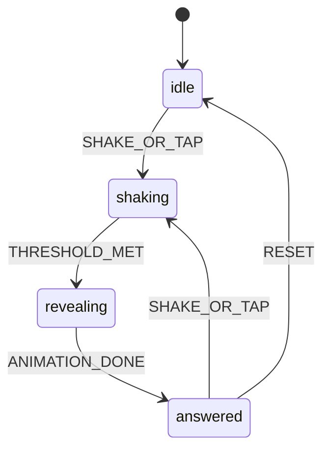

# ARCHITECTURE — Magik 8

## Stack

| Layer | Choice |
|-------|--------|
| Build | Vite 6 |
| UI | React 19 + TypeScript |
| Style | Tailwind CSS v4 |
| Motion | `motion/react` |
| PWA | `vite-plugin-pwa` (generateSW) |
| Test | Vitest (+ Playwright in PHASE-6) |
| Deploy | Vercel / Cloudflare Pages (HTTPS) |

## Target file tree (post PHASE-1)

```
magik-8/
  docs/                 # spec (this tree)
  public/
    icons/
  src/
    main.tsx
    App.tsx
    index.css           # tokens from DESIGN.md
    components/
      MagikBall.tsx
      AnswerTriangle.tsx
      ThemeChips.tsx
      ShakeCTA.tsx
      PermissionSheet.tsx
      ShareSheet.tsx
      MuteToggle.tsx
    hooks/
      useShake.ts
      useOracleMachine.ts
      useAudio.ts
      useHaptics.ts
    lib/
      pickAnswer.ts
      rng.ts
      easterEgg.ts
    data/
      answers.ts        # generated from ANSWERS.md
    types/
      oracle.ts
  vite.config.ts
  vitest.config.ts
```

## State machine (REQ-010)



Implement in `useOracleMachine.ts`:

```ts
type OraclePhase = 'idle' | 'shaking' | 'revealing' | 'answered';
```

Events: `SHAKE_OR_TAP`, `THRESHOLD_MET`, `ANIMATION_DONE`, `RESET`, `THEME_CHANGE` (only from idle/answered).

## Data flow

1. `ThemeChips` → `selectedPackId` (localStorage `magik_theme`)
2. `useShake` / `ShakeCTA` → dispatch `SHAKE_OR_TAP`
3. On reveal start: `pickAnswer(packId)` + `maybeEasterEgg()`
4. `AnswerTriangle` displays result; `aria-live` update
5. `ShareSheet` reads last answer snapshot

## Module boundaries (for parallel agents)

| Module | PHASE | Agent may own |
|--------|-------|---------------|
| `hooks/useShake.ts`, `PermissionSheet` | 3 | Sensors agent |
| `components/Magik*`, `useOracleMachine` | 2 | Core agent |
| `lib/pickAnswer`, `data/answers` | 2 | Core agent |
| `hooks/useAudio`, SFX | 4 | Polish agent |
| `ShareSheet`, PWA manifest | 5 | Ship agent |

**Merge rule:** Sensors agent must not edit `MagikBall` animation timings without Coordinator approval (interface: `onShakeDetected(): void`).

## Key interfaces

```ts
// src/types/oracle.ts
export type AnswerCategory = 'affirmative' | 'neutral' | 'negative';

export type Answer = {
  id: string;
  text: string;
  category: AnswerCategory;
};

export type ThemePack = {
  id: 'classic' | 'career' | 'party';
  label: string;
  answers: Answer[]; // length 20
};

export type OracleResult = {
  answer: Answer;
  isEasterEgg: boolean;
  easterEggText?: string;
};
```

```ts
// src/lib/pickAnswer.ts
export function pickAnswer(pack: ThemePack): Answer;
```

RNG: `crypto.getRandomValues` → uniform index 0..19.

## PWA (REQ-060)

- `registerType: 'autoUpdate'`
- Precache: JS, CSS, HTML, icons, fonts
- No API runtime caching (static app)
- Dev HTTPS: `@vitejs/plugin-basic-ssl` or mkcert

## Config defaults

| Constant | Value | Doc |
|----------|-------|-----|
| `SHAKE_THRESHOLD` | 15 | SENSORS.md |
| `SHAKE_COOLDOWN_MS` | 1000 | SENSORS.md |
| `EASTER_EGG_RATE` | 1/40 | PRD REQ-045 |
| `FIRST_VISIT_EGG` | true once | PRD REQ-045 |

## Dependencies (allowlist)

**Runtime:** `motion`, `howler` (or minimal Web Audio helper)

**Dev:** `vite-plugin-pwa`, `@vitejs/plugin-basic-ssl`, `vitest`, `tailwindcss`

**Optional PHASE-5:** `html-to-image`

**Forbidden v1:** `three`, `@react-three/fiber`, `shake.js`

## Scripts (PHASE-1)

```json
{
  "dev": "vite --host",
  "build": "tsc -b && vite build",
  "preview": "vite preview",
  "test": "vitest run"
}
```

Add `"dev:https": "vite --host --https"` when basic-ssl configured.
