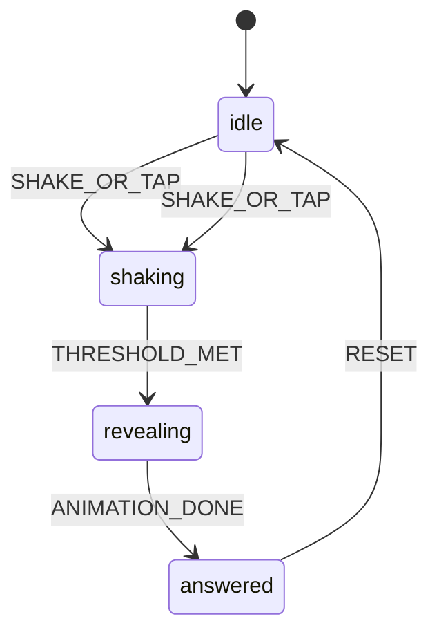

# ARCHITECTURE — Magik 8

## Stack

| Layer | Choice |
|-------|--------|
| Build | Vite 6 |
| UI | React 19 + TypeScript |
| Style | Tailwind CSS v4 + `--m8-*` tokens (`src/index.css`) |
| Motion | `motion/react` |
| PWA | `vite-plugin-pwa` (generateSW) |
| Test | Vitest + Playwright |
| Deploy | Vercel / Cloudflare Pages (HTTPS) |

## File tree (current)

```
magik-8/
  docs/                      # PRD, DESIGN-V2, HANDOFF, …
  magik-8_CLAUDE_DESIGN/     # design export (reference; do not delete)
  public/
    icons/
  src/
    main.tsx
    App.tsx
    index.css                # --m8-* tokens, chrome utilities
    context/
      OracleContext.tsx
      AudioContext.tsx
    components/
      MagikBall.tsx
      AnswerTriangle.tsx
      Wordmark.tsx
      HUDStrip.tsx
      ThemeChips.tsx
      ShakeCTA.tsx
      PermissionSheet.tsx
      ShareSheet.tsx
      ShareCard.tsx
      MuteToggle.tsx
      ShakeSensors.tsx
      OracleAudioBridge.tsx
    hooks/
      useShake.ts
      useOracleMachine.ts
      useAudio.ts
      useHaptics.ts
    lib/
      pickAnswer.ts
      rng.ts
      easterEgg.ts
      shareExport.ts
    data/
      answers.ts               # from ANSWERS.md
    types/
      oracle.ts
  e2e/
    smoke.spec.ts
  vite.config.ts
  vitest.config.ts
  vercel.json
```

## State machine (REQ-010)



Implement in `useOracleMachine.ts`:

```ts
type OraclePhase = 'idle' | 'shaking' | 'revealing' | 'answered';
```

Events: `SHAKE_OR_TAP`, `THRESHOLD_MET`, `ANIMATION_DONE`, `RESET`, `THEME_CHANGE` (only from idle/answered).

**Ritual lock (FIX-3):** `SHAKE_OR_TAP` only from `idle`. From `answered`, user must **reset** (CTA, ball tap) before a new shake/tap cycle.

## Data flow

1. `ThemeChips` → `packId` (localStorage `magik_theme`)
2. `ShakeSensors` / `ShakeCTA` / Space key → `SHAKE_OR_TAP` or sensor `onThresholdMet`
3. On reveal: `pickAnswer(packId)` + `maybeEasterEgg()`
4. `AnswerTriangle` displays result; `aria-live` update
5. `ShareSheet` + off-screen `ShareCard` → PNG export
6. `App` increments `m8_sesh` in localStorage when `phase === 'answered'` (display-only HUD)

## Module boundaries

| Module | Owner concern |
|--------|----------------|
| `hooks/useShake.ts`, `PermissionSheet`, `ShakeSensors` | Sensors |
| `useOracleMachine`, `OracleContext` | Ritual state |
| `MagikBall`, `AnswerTriangle` | Ball + reveal UI |
| `Wordmark`, `HUDStrip`, chrome components | Design V2 shell |
| `hooks/useAudio`, `OracleAudioBridge` | SFX |
| `ShareCard`, `shareExport`, PWA | Export + install |

**Merge rule:** Sensors must not edit `MagikBall` animation timings without Coordinator approval.

## Key interfaces

```ts
// src/types/oracle.ts
export type AnswerCategory = 'affirmative' | 'neutral' | 'negative';

export type Answer = {
  id: string;
  text: string;
  category: AnswerCategory;
};

export type ThemePack = {
  id: 'classic' | 'career' | 'party';
  label: string;
  answers: Answer[]; // length 20
};

export type OracleResult = {
  answer: Answer;
  isEasterEgg: boolean;
  easterEggText?: string;
};
```

RNG: `crypto.getRandomValues` → uniform index 0..19.

## PWA (REQ-060)

- `registerType: 'autoUpdate'`
- Precache: JS, CSS, HTML, icons, fonts
- `theme_color` / `background_color`: `#1a1a20` (aligned with `--m8-bg`)
- Dev HTTPS: `npm run dev:https` (`@vitejs/plugin-basic-ssl`)

## Config defaults

| Constant | Value | Doc |
|----------|-------|-----|
| `SHAKE_THRESHOLD` | 18 | SENSORS.md |
| `SHAKE_COOLDOWN_MS` | 2000 | SENSORS.md |
| `SHAKE_SPIKE_DELTA` | 5 | SENSORS.md |
| `SHAKE_SUSTAINED_SAMPLES` | 3 | SENSORS.md |
| `SHAKE_DURATION_MS` | 400 | useOracleMachine |
| `REVEAL_MS` | 600 | AnswerTriangle |
| `EASTER_EGG_RATE` | 1/40 | PRD REQ-045 |

## Dependencies (runtime)

**Runtime:** `motion`, `html-to-image`

**Dev:** `vite-plugin-pwa`, `@vitejs/plugin-basic-ssl`, `vitest`, `@playwright/test`, `tailwindcss`, `lighthouse`

**Forbidden v1:** `three`, `@react-three/fiber`, `shake.js`

## Scripts

```json
{
  "dev": "vite --host",
  "dev:https": "VITE_HTTPS=true vite --host",
  "build": "tsc -b && vite build",
  "preview": "vite preview",
  "test": "vitest run",
  "test:e2e": "playwright test",
  "test:lighthouse": "node scripts/lighthouse.mjs"
}
```
