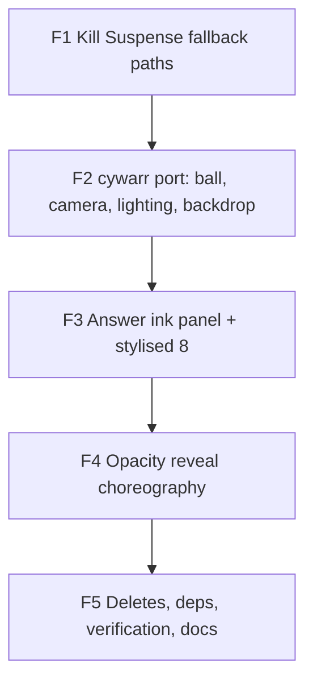

> **Superseded** by [`PLAN-VISUAL-V5-CYWARR-FIDELITY.md`](./PLAN-VISUAL-V5-CYWARR-FIDELITY.md) — V5 fixes the V4 render layer (white box, chrome ball, weak shake). Historical reference only.

# Plan — Visual V4 ("cywarr Port")

> **Audience:** the **Coordinator** ([`prompts/COORDINATOR-VISUAL-V4-CYWARR.md`](./prompts/COORDINATOR-VISUAL-V4-CYWARR.md))
> and the phase implementer sub-agents it spawns. This is the single source of truth for the V4 visual
> rebuild. The phase table (§ Fix plan) is the source of deliverables, acceptance, owned files, and
> locks. The cywarr ↔ ours comparison (§ cywarr vs ours) holds every parameter every implementer
> copies into code.
>
> **Read order for a new agent:** [`README.md`](./README.md) → [`HANDOFF-VISUAL-V4-CYWARR.md`](./HANDOFF-VISUAL-V4-CYWARR.md) → this file (your phase row + § cywarr vs ours).

V4 replaces the V3 render layer. State logic — [`useOracleMachine`](../src/hooks/useOracleMachine.ts),
[`useShake`](../src/hooks/useShake.ts), [`OracleContext`](../src/context/OracleContext.tsx), themes,
answers, audio, haptics — is **unchanged**. The CSS fallback ([`MagikBall`](../src/components/MagikBall.tsx))
stays as the reduced-motion / no-WebGL fallback.

---

## 1. Context — what we are fixing

V3 ([`PLAN-VISUAL-V3.md`](./PLAN-VISUAL-V3.md)) shipped a 3D ball that has two user-visible failure modes,
both reproduced on real devices and visible in the screenshots the user posted:

1. **The 3D ball sometimes doesn't load** — the user sees the CSS fallback. Root cause: the single outer
   `<Suspense fallback={<MagikBall/>}>` in [`OracleStage`](../src/components/OracleStage.tsx) catches every
   suspension inside the 3D tree. drei `<Environment>` loads a 1.5 MB HDR via `RGBELoader` (suspends on
   first mount), and drei `<Text>` calls `preloadFont` on `/fonts/oswald-600.woff2` (suspends the first
   time the answer text renders). Both fire the same fallback, so the CSS ball replaces the 3D one mid-flow.

2. **Even when 3D loads, it looks broken and reverts to CSS after the reveal.** Root cause is the same
   Suspense path, plus four secondary defects:
   - Lighting + tone mapping make the ball read as a chrome glass orb (`envMapIntensity: 1.2`,
     `clearcoat: 1`, ACES tone-map of a bright studio HDRI, `Bloom { intensity: 0.28 }`).
   - The answer window's Z ordering is wrong — `MeshTransmissionMaterial` glass disc sits at `z = +0.02`,
     but the `Die` face circle ends up at `z ≈ +0.09–0.14` after `DIE_ORIENTATION`, so the triangle floats
     **in front** of the "glass" instead of refracting through it.
   - `MeshTransmissionMaterial` on a flat disc is the worst case for that material (it's volumetric);
     `samples: 6` + `backside: true` + `multisampling: 4` Bloom + `ChromaticAberration` is a known iOS
     context-loss combination (drei #2448, #2261; r3f #3566).
   - The shake choreography accumulates a constant `{x:9, y:7, z:5}` rad/s spin and the GSAP cleanup
     calls `gsap.context().revert()` on every phase change, snapping the rotation back for one frame at
     each transition.

V4 replaces the entire render layer with a port of **cywarr/Magic8Ball**
([js/main.js](https://github.com/cywarr/Magic8Ball/blob/main/js/main.js)) — a single-file three.js Magic 8
Ball that ships **no HDR, no `MeshTransmissionMaterial`, no troika text**. Those three things are exactly
what's causing our Suspense flicker. We delete them, port cywarr's geometry + shader recipe, and the
failure mode goes away by **removing** the dependencies, not by working around them.

---

## 2. Locked decisions (do not relitigate)

| Decision | Value |
|----------|-------|
| **Render target** | Direct port of cywarr/Magic8Ball. Partial-sphere shell with a glassy lens cap on top; ink panel of 4 instanced quads inside; procedural simplex-noise backdrop sphere; ambient-only lighting + bundled equirect JPG env map; FBM-noise roughness shimmer on the ball; no postprocessing by default. |
| **Reveal language** | **No rotation choreography.** The lens cap is always pointed at the camera. Reveal = two opacity tweens on shader uniforms (`baseVisibility 1 → 0.375` then `textVisibility 0 → 1`), driven by GSAP. "Shake" reads as a `time`-uniform speed-up + tiny position jitter. |
| **"8" decal** | **Deleted.** cywarr's ink shader draws a triangle + two rings; the rings together read as an "8". No more disc mesh, no mirrored "8" bug. |
| **Camera** | `PerspectiveCamera({ fov: 60, near: 0.05, far: 50 })` at `new Vector3(0, 1, 0.375).setLength(3.75)` for our 1-unit ball — directly scaled from cywarr's 4-unit ball at distance 15. Optional `<OrbitControls>` (damping, no pan, no zoom, polar 0.2π–0.55π) disabled during `shaking` / `revealing`. |
| **Lighting** | One `<ambientLight intensity={1.0} />` + a small bundled equirect JPG (`public/env/studio.jpg`, ~80 KB) loaded via `TextureLoader` and assigned to `scene.environment`. No directionals. `gl.toneMappingExposure = 1.0`. |
| **No CSG, no clip-plane (default)** | The partial-sphere shell + lens cap already reads as a real recessed window in cywarr. `three-bvh-csg` and `localClippingEnabled` remain optional follow-ups. |
| **FSM contract** | Unchanged. `idle → shaking → revealing → answered → idle`. `ANIMATION_DONE` still dispatched at the end of `revealing` (now at the end of the second opacity tween). Reveal budget stays at `REVEAL_MS = 600` ms. |
| **CSS fallback** | Unchanged path. Still kicks in for `prefers-reduced-motion`, low-power, no-WebGL, and runtime errors via a new `OracleErrorBoundary`. Gets a new `renderingLocked` prop so the fallback can't dispatch state while the 3D path is still loading. |
| **Merge policy** | Coordinator auto-merges each phase PR once CI is green. Pauses for the human only on a real decision or a merge conflict. |
| **Deploy** | Overseer-only. No agent runs Vercel CLI. |

---

## 3. Architecture — the integration seam

```
OracleStage (existing)
 ├─ useWebglCapability + VITE_WEBGL flag → CSS MagikBall
 └─ <Suspense fallback={<MagikBall renderingLocked />}>
      <OracleErrorBoundary>          (new in F1)
        <OracleScene>                (rewritten in F2)
          <Canvas>
            <ambientLight />
            <Background />           (cywarr noise sphere, F2)
            <Ball />                 (cywarr shell + shimmer, F2)
            <AnswerPanel />          (cywarr instanced ink, F3)
            <Effects /> (optional)
          </Canvas>
        </OracleScene>
      </OracleErrorBoundary>
    </Suspense>
```

The reveal contract `useOracleChoreography(...)` continues to dispatch `onAnimationDone()` at the end of
`revealing`. The CSS `<AnswerTriangle>` does the same on its own timer. Both renderers consume the same
`OracleContext` machine and `OracleResult`.

---

## 4. cywarr vs ours — what we copy, what we adapt

User direction: "make it similar in terms of design, animation, reveal". The cywarr ball is the **target**
aesthetic, not an inspiration. Everywhere the two differ, we move toward cywarr unless a fix conflicts
with our FSM.

| Aspect | cywarr | Ours today | What we do |
|---|---|---|---|
| Ball geometry | Partial sphere φ 0.15π–0.85π with `shiftSphereSurface` "petal" rim + inner shell + `buildSides` bridge | Full smooth sphere | Port cywarr's three-part shell |
| "8" decal | None — the ink panel's two rings + triangle form the "8" graphically | White circle + CanvasTexture "8" decal | **Delete the decal.** The "8" lives inside the ink panel |
| Glass | Tiny spherical cap (R-0.01, φ 0–0.15π), `MeshStandard metalness:1 roughness:0 transparent opacity:0.25 envMapIntensity:10` | drei `MeshTransmissionMaterial` flat disc | Port the cap material verbatim |
| Camera | fov 60, position `(0, 1, 0.375).setLength(15)`, OrbitControls (damping, no autorotate, no pan, min/max 8–15) | fov 42, `(0, 0, 2.8)`, no controls | Adopt cywarr's pose; scale to our 1-unit ball; OrbitControls optional (damping, idle-only) |
| Lighting | AmbientLight only + env map | HDRI Environment + 2 directionals + ambient | Drop directionals; ambient + env map |
| Env map | Small equirect JPG, `EquirectangularReflectionMapping` | 1.5 MB HDR via drei `<Environment>` | Bundled equirect JPG (~80 KB) |
| Backdrop | Inverted sphere radius 1000, simplex-4D noise shader, `time`-driven | Flat plane metaball shader | Port cywarr's sky sphere |
| Surface shader | FBM-noise modulating `roughnessFactor` via `onBeforeCompile`, `time`-driven shimmer | Static clearcoat physical | Port FBM injection verbatim; retint via our tokens |
| Rim band | Wavy red sine stripes via shader | none | Optional decorative band tinted from our `--m8-stripe-shadow` (subtler than cywarr's red) |
| Inner cavity | Solid dark blue (`0x000088`), BackSide | none | Solid `--m8-fluid-deep` BackSide |
| Ink panel | 4 instanced quads, AdditiveBlending, shader SDFs (triangle + 2 rings), CanvasTexture phrase | drei `Text` on tilted icosahedron face | **Direct port**, retinted to our tokens |
| Phrase text | CanvasTexture per phrase, drawn on mount, no font load | troika SDF Text with woff2 preload | Direct port; use Oswald / system stack on the canvas |
| Idle "alive" | Surface shimmer + backdrop drift from shared `time` uniform | drei `<Float>` bob | Shimmer + drift; no `<Float>` |
| Shake motion | None | Accumulating 9/7/5 rad/s spin | **Replace with shader speed-up:** `timeScale → 3.0` during `shaking`; optional micro position-jitter ≤ 0.5° |
| Reveal motion | TWEEN: `baseVisibility 1 → 0.375` (2 s) → `textVisibility 0 → 1` (2 s) | GSAP rotation + ink fill + Text fade | Direct port, compressed to our 600 ms `REVEAL_MS` (300 ms + 300 ms) |
| Re-ask | `textVisibility 1 → 0` (1 s) → `0 → 1` (2 s) with new text | reset → idle → shake → reveal | Reset transitions via the same opacity tweens (1 → 0) before the FSM returns to idle |
| Interaction | Pointer-up raycast on the ink panel | Tap whole ball + device shake | Keep our richer interaction; both routes call the same opacity chain |
| Easter egg | n/a | Amber tint | Add an `isEasterEgg` uniform in the ink panel shader — swaps diffuse + text tint to `--m8-amber` |
| Render order | 9998 (ink) / 9999 (ball) | depth ordering | Use cywarr's render-order pattern |

### Reveal contract translation

```
oracle phase      visual response (cywarr language)
─────────────     ────────────────────────────────────────────────
idle              baseVisibility=1, textVisibility=0, timeScale=1.0
shaking (400ms)   baseVisibility=1, textVisibility=0, timeScale=3.0 (shimmer speeds up)
                  + optional ≤0.5° position jitter
revealing (600ms) tween A: baseVisibility 1 → 0.375 (300ms),
                  then chained tween B: textVisibility 0 → 1 (300ms, new text)
                  onComplete → onAnimationDone() → answered
answered          baseVisibility=0.375, textVisibility=1, timeScale=1.0
reset             textVisibility 1 → 0 (200ms), baseVisibility 0.375 → 1 (200ms)
                  → idle
```

The 600 ms `REVEAL_MS` is split 50/50 between the two tweens. The cywarr 4-second feel can come from an
opt-in slow mode later — for V4 the FSM's existing contract wins. Easter-egg flag flips the diffuse / text
uniforms to amber **before** the textVisibility tween starts.

---

## 5. References

- **cywarr/Magic8Ball — [`js/main.js`](https://github.com/cywarr/Magic8Ball/blob/main/js/main.js)**. The
  target. Single file. Geometry build (`g1+g2+g3+g4`), `shiftSphereSurface`, `buildSides`, the FBM and
  Simplex-4D noise shader snippets, the ink panel's `tri(uv, N)` SDF, and the `createTextures` phrase
  canvas helper are all copied verbatim by F2 and F3.
- **three.js [`webgl_geometry_csg`](https://github.com/mrdoob/three.js/blob/master/examples/webgl_geometry_csg.html)** — `three-bvh-csg` `Evaluator.evaluate(base, brush, SUBTRACTION)` for an opt-in carved recess if needed later.
- **three.js [`webgl_clipping_intersection`](https://github.com/mrdoob/three.js/blob/master/examples/webgl_clipping_intersection.html)** — `renderer.localClippingEnabled = true` + per-material `clippingPlanes` as the cheap alternative to CSG.
- **three.js `webgl_geometry_convex` / `webgl_camera` / `webgl_effects_ascii`** — referenced for completeness; not adopted but confirm clip-plane + shader stylisation are first-class in vanilla three.
- **Drei `Text` source** ([drei #562](https://github.com/pmndrs/drei/blob/7d901b5c/src/core/Text.tsx)) — confirms `Text` calls `suspend(preloadFont, [...])`, which is why every first-reveal pops the outer Suspense back to CSS today. Background context for why F1 deletes it.

---

## 6. Fix plan

Five phases. Branch per phase: `fix/v4-<slug>`. One PR per phase. Coordinator auto-merges on green.

### F1 — Kill the Suspense fallback paths *(highest priority, gates everything else)*

- **Deliver:**
  - Drop drei `<Environment>` and `public/hdri/`. Replace with `public/env/studio.jpg` (~80 KB equirect, `EquirectangularReflectionMapping`) preloaded at the `OracleScene` module top via `useLoader.preload(TextureLoader, '/env/studio.jpg')`. Set on `scene.environment` once on mount in `Lighting`.
  - Delete drei `<Text>` usage. Stub `AnswerText.tsx` (or schedule the deletion for F3) so nothing in the 3D tree calls `preloadFont` any more. Until F3 lands, the answer plane renders nothing — that's fine because F1's only job is to remove suspenders.
  - Delete drei `MeshTransmissionMaterial` from [`AnswerWindow.tsx`](../src/three/AnswerWindow.tsx). Replace with a temporary `<meshStandardMaterial transparent opacity={0.25} metalness={1} roughness={0} envMapIntensity={10} />` so the visual is roughly intact until F2/F3.
  - New [`src/components/OracleErrorBoundary.tsx`](../src/components/OracleErrorBoundary.tsx) (class component) that wraps `<OracleScene/>` and renders `<MagikBall renderingLocked />` on `componentDidCatch`.
  - Update [`OracleStage`](../src/components/OracleStage.tsx) to `<Suspense fallback={<MagikBall renderingLocked />}><OracleErrorBoundary><OracleScene/></OracleErrorBoundary></Suspense>`.
  - Add `renderingLocked` prop to [`MagikBall`](../src/components/MagikBall.tsx). When true: disable the tap/shake button (`disabled`), skip motion-sensor wiring, render in muted opacity so the user knows it's a transient state.
  - In `OracleScene`'s `onCreated`: attach `webglcontextlost` (preventDefault + bump a state flag → boundary renders the locked CSS ball) and `webglcontextrestored` (bump a `key` to remount the canvas) listeners on `gl.domElement`.
  - Relax [`useWebglCapability`](../src/three/useWebglCapability.ts): drop `failIfMajorPerformanceCaveat: true`; instead probe `WEBGL_debug_renderer_info.UNMASKED_RENDERER_WEBGL` and only treat `"SwiftShader" | "llvmpipe"` as un-capable. Drop the `deviceMemory <= 2` branch. Update [`useWebglCapability.test.ts`](../src/three/useWebglCapability.test.ts).
- **Files (own / edit):** `src/components/OracleStage.tsx`, `src/components/OracleErrorBoundary.tsx` (new), `src/components/MagikBall.tsx`, `src/three/Lighting.tsx`, `src/three/OracleScene.tsx`, `src/three/useWebglCapability.ts`, `src/three/useWebglCapability.test.ts`, `src/three/AnswerWindow.tsx` (temporary material swap), `src/three/AnswerText.tsx` (stub or empty), `public/env/studio.jpg` (new asset), `public/hdri/*` (delete), `vite.config.ts` (workbox precache update).
- **Do not touch:** `src/three/Ball.tsx`, `src/three/Background.tsx`, `src/three/Effects.tsx`, `src/three/useOracleChoreography.ts`, FSM / context / data / shareExport / theme / chrome.
- **Accept:** `tsc -b` + `npm run build` + `npm test` + `npm run test:e2e` all green. With `VITE_WEBGL=true VITE_WEBGL_E2E=true npm run preview`: tap-shake-reveal-reset cycle never replaces the 3D canvas with the CSS ball (assert `[data-m8-oracle-canvas]` stays in the DOM across all phase transitions). Flag-off behaviour is byte-for-byte unchanged.

### F2 — cywarr ball geometry, camera, lighting, backdrop *(after F1)*

- **Deliver:** the visual identity of the ball + scene matches cywarr modulo our colour tokens.
  - Camera in `OracleScene`: `PerspectiveCamera({ fov: 60, near: 0.05, far: 50 })` at `new Vector3(0, 1, 0.375).setLength(3.75)`. Optional `<OrbitControls enableDamping enablePan={false} enableZoom={false} minPolarAngle={Math.PI*0.2} maxPolarAngle={Math.PI*0.55} />` — only enabled when `phase === 'idle' || phase === 'answered'`.
  - Rewrite [`src/three/Ball.tsx`](../src/three/Ball.tsx) as a direct port of cywarr's `g1+g2+g3+g4` build:
    - `g1 = SphereGeometry(R=1, 128, 64, 0, 2π, 0.15π, 0.85π)` + `shiftSphereSurface(g1, true)` (port verbatim).
    - `g2 = g1.clone().scale(0.9, 0.9, 0.9)`.
    - `g3 = buildSides(g1)` (port verbatim).
    - `g4 = SphereGeometry(R - 0.01, 128, 32, 0, 2π, 0, 0.15π)`.
    - `BufferGeometryUtils.mergeGeometries([g1, g2, g3, g4], true)`. Use the modern API (`mergeBufferGeometries` is deprecated).
    - Wrap in a parent `<group>` at scene origin. The group **does not rotate** during reveal.
  - Materials (4-element array, matching the merged groups; port the cywarr recipe, retint via our tokens):
    - `[0] ball`: `MeshStandardMaterial({ envMap, roughness: 0.75, metalness: 1, defines: { USE_UV: '' } })`. `color` derived from `--m8-sphere-core` blended toward the theme accent and brightened (cywarr does `new Color('indigo').addScalar(0.25).multiplyScalar(5)` — we do the equivalent so reflections take on our cobalt mood). `onBeforeCompile` injects cywarr's FBM noise (`fbm`, `noise`) + `uniform float time; varying vec3 vPos;` + `vPos = position;` after `#include <begin_vertex>`; replaces `#include <roughnessmap_fragment>` with cywarr's FBM-modulated `roughnessFactor` block verbatim. Time uniform is shared with backdrop + (optional) ink panel.
    - `[1] inner cavity`: `MeshLambertMaterial({ color: themedFluidDeep, side: BackSide })` — themed dark cobalt.
    - `[2] sides bridge`: `MeshLambertMaterial({ color: --m8-stripe-shadow, defines: { USE_UV: '' } })` with cywarr's sine-stripe `onBeforeCompile` block, sine amplitude × 0.4 so the rim reads as a subtle decorative band rather than cywarr's vivid red. Theme packs can re-tint via a uniform.
    - `[3] lens cap`: `MeshStandardMaterial({ envMap, envMapIntensity: 10, color: 0xffffff, transparent: true, opacity: 0.25, metalness: 1, roughness: 0 })` — **verbatim cywarr**.
  - `ball.renderOrder = 9999`.
  - **No "8" decal.** Delete `createEightDiscTexture`, the disc mesh, `EIGHT_*` constants, and `isEightDiscVisible` from the choreography hook. Delete [`scripts/generate-eight-texture.mjs`](../scripts/generate-eight-texture.mjs).
  - Rewrite [`src/three/Lighting.tsx`](../src/three/Lighting.tsx): one `<ambientLight intensity={1.0} />`. Load the equirect JPG via `useLoader(TextureLoader, '/env/studio.jpg')`, set `tex.colorSpace = SRGBColorSpace`, `tex.mapping = EquirectangularReflectionMapping`, assign to `scene.environment` (and optionally `scene.background = null`). Set `gl.toneMappingExposure = 1.0` in `OracleScene`.
  - Rewrite [`src/three/Background.tsx`](../src/three/Background.tsx) as cywarr's noise sphere: `SphereGeometry(1000, 100, 50)` + `BackSide`, `ShaderMaterial` with cywarr's `noiseV3` Simplex-4D snippet. Fragment shader: `vec3 col = vec3(0.375); float ns = snoise(vec4(vNormal*2, time*0.1)); col = mix(col*1.5, col, pow(abs(ns), 0.5));` verbatim. Per-pack retint by mixing `col` toward `PACK_FLUID_ACCENTS[packId].bgDeep`. Shares the `time` uniform with the ball.
  - Default-off postprocessing: delete the `<EffectComposer>` block from [`Effects.tsx`](../src/three/Effects.tsx) (rely on env reflection + shimmer; CSS `.m8-grain` + `.m8-vignette` keep the 2000s overlay). If we later need a touch of glow, gate `<Bloom intensity={0.1} luminanceThreshold={0.95} mipmapBlur />` behind a feature flag.
  - Delete [`src/three/shaders/gradient.frag`](../src/three/shaders/gradient.frag) and [`gradient.vert`](../src/three/shaders/gradient.vert).
- **Files (own / edit):** `src/three/Ball.tsx`, `src/three/Lighting.tsx`, `src/three/Background.tsx`, `src/three/Effects.tsx`, `src/three/OracleScene.tsx`, `src/three/shaders/gradient.{frag,vert}` (delete), `scripts/generate-eight-texture.mjs` (delete).
- **Do not touch:** `src/three/AnswerWindow.tsx` (F3 owns it), `src/three/AnswerText.tsx` / `Die.tsx` / `Liquid.tsx` (F3/F5), `useOracleChoreography.ts` (F4), FSM / context / chrome.
- **Accept:** the ball reads as a deep glossy 8-ball with a subtle marbled shimmer, lens cap on top, soft cloudy backdrop. No more chrome-orb look. tsc / build / test / e2e green. Flag-off still byte-for-byte unchanged.

### F3 — Answer ink panel (cywarr port) + stylised "8" *(after F2)*

- **Deliver:**
  - New [`src/three/answerAtlas.ts`](../src/three/answerAtlas.ts):
    - Module init: iterate every answer in [`src/data/answers.ts`](../src/data/answers.ts) (classic + career + party + easter-egg variants), call cywarr's `createTextures` recipe per phrase: 256×256 canvas, `bold 30px 'Oswald','Courier New'`, split on `|` for line breaks (auto-wrap at ~10 chars/line otherwise), white fill, transparent background, `textBaseline: 'middle'`. Wrap as `CanvasTexture`, store in `Map<string, CanvasTexture>` keyed by the canonical answer string.
    - Export `getAnswerTexture(answerKey, isEasterEgg)` for the panel.
  - New [`src/three/AnswerPanel.tsx`](../src/three/AnswerPanel.tsx) (replaces `AnswerWindow.tsx`):
    - Geometry: `PlaneGeometry(0.4, 0.4)` (scaled to our 1-unit ball), `ig.rotateX(-Math.PI * 0.5)` so it lies flat under the lens cap. `ig.setAttribute('instId', new InstancedBufferAttribute(new Float32Array([0,1,2,3]), 1))`. `InstancedMesh(ig, m, 4)`, `setMatrixAt(i, new Matrix4().setPosition(0, lensTopY - 0.05*(3-i), 0))` — 4 stacked planes 0.05 apart (port cywarr's `step = 0.05` exactly). `iWriting.renderOrder = 9998`.
    - Material: `MeshBasicMaterial({ color: themedInkColor, transparent: true, opacity: 0.9, blending: AdditiveBlending, defines: { USE_UV: '' } })`. `color` = theme-mapped `--m8-fluid-hi` (cywarr's `new Color(0, 0.5, 1)`).
    - `onBeforeCompile` injects uniforms `baseVisibility`, `textVisibility`, `text` (sampler2D), `isEasterEgg` (float), `inkTextTint` (vec3). Vertex shader: `attribute float instId; varying float vInstId; vInstId = instId;`. Fragment shader: cywarr's `tri(uv, N)` SDF helper + the replacement of `vec4 diffuseColor = vec4(diffuse, opacity)` with cywarr's full block — triangle outline (`tri(uv, 3)`) + two ring SDFs (`tri(uv, 60)` at `uv - (0, 0.5)` and `uv + (0, 0.25)`, forming the stylised "8") + text texture sampled with `text.rgb * inkTextTint`. Per-instance fade: `opacity * ((vInstId / 3.) * 0.9 + 0.1)`.
    - `inkTextTint` defaults to `vec3(0.95, 0.95, 0.93)` (our `--m8-answer-ink`); on easter egg, swap to `vec3(1.0, 0.65, 0.18)` (our `--m8-amber`).
    - State integration: reads `phase`, `result`, `packId` from `OracleContext`. Holds refs for the four uniforms. Exposes them to `useOracleChoreography` via a shared module-level singleton (F4 ties this together). When `phase === 'revealing'`: set `text` uniform to the new answer's `CanvasTexture` **before** F4's tween starts.
  - Mount `<AnswerPanel />` inside `<Ball />`'s parent group in `OracleScene.tsx` so the panel inherits the ball's transform (it sits inside the lens cavity by construction).
  - Delete [`src/three/Die.tsx`](../src/three/Die.tsx), [`src/three/Liquid.tsx`](../src/three/Liquid.tsx), [`src/three/AnswerWindow.tsx`](../src/three/AnswerWindow.tsx), [`src/three/AnswerText.tsx`](../src/three/AnswerText.tsx), [`src/three/shaders/liquid.frag`](../src/three/shaders/liquid.frag), [`src/three/shaders/liquid.vert`](../src/three/shaders/liquid.vert), and [`src/three/answerText.test.ts`](../src/three/answerText.test.ts).
  - New [`src/three/answerAtlas.test.ts`](../src/three/answerAtlas.test.ts): asserts every answer in [`src/data/answers.ts`](../src/data/answers.ts) (including easter-egg variants) yields a `CanvasTexture` of non-zero size; the keyed lookup round-trips.
- **Files (own / edit):** `src/three/answerAtlas.ts` (new), `src/three/answerAtlas.test.ts` (new), `src/three/AnswerPanel.tsx` (new), `src/three/Die.tsx` (delete), `src/three/Liquid.tsx` (delete), `src/three/AnswerWindow.tsx` (delete), `src/three/AnswerText.tsx` (delete), `src/three/shaders/liquid.{frag,vert}` (delete), `src/three/answerText.test.ts` (delete), `src/three/OracleScene.tsx` (wire panel into scene).
- **Do not touch:** `src/three/Ball.tsx` (F2 owns it after merge), `src/three/Background.tsx` (F2), `src/three/useOracleChoreography.ts` (F4), FSM / context / chrome.
- **Accept:** When the FSM is forced into `answered` (test harness or dev key), the ink panel shows the blue triangle + the "8" rings + the answer text, all inside the lens cap, with no "die in front of glass" floating sticker. Easter-egg amber visible when triggered. tsc / build / test / e2e green.

### F4 — Opacity reveal choreography *(after F3)*

- **Deliver:** rewrite [`src/three/useOracleChoreography.ts`](../src/three/useOracleChoreography.ts) to drive shader uniforms, not transforms.
  - Shared uniform refs (module-level singleton imported by `Ball`, `Background`, `AnswerPanel`):
    - `time` — incremented every frame in `useFrame`, scaled by `timeScale`. Shared by ball roughness shader + backdrop noise + (optionally) ink panel for subtle pulsing.
    - `baseVisibility` (number) — `1` idle, fades to `0.375` after reveal.
    - `textVisibility` (number) — `0` idle, fades to `1` on reveal.
    - `timeScale` (number) — `1.0` idle, ramps to `3.0` during shaking, returns to `1.0`.
    - `isEasterEgg` (number, used as bool) — flag for panel tint.
  - Phase → tween mapping (`gsap.to`, compressed from cywarr's 2 s to our `REVEAL_MS = 600`):
    - `idle`: tween `baseVisibility → 1`, `textVisibility → 0`, `timeScale → 1.0`, all 200 ms ease-out.
    - `shaking` (400 ms): tween `timeScale → 3.0` over 200 ms easeOut, hold. Optional micro-jitter on the parent group's `position` (≤ 0.01 along Y, ≤ 1° on Z) for tactile feedback — **not a rotation**.
    - `revealing` (600 ms):
      1. Set `isEasterEgg` uniform from `result.isEasterEgg`.
      2. Call `AnswerPanel.setText(getAnswerTexture(getAnswerKey(result), result.isEasterEgg))` so the SDF + sample are ready before fade-in.
      3. Tween A: `baseVisibility 1 → 0.375` over 300 ms, ease `cubic-bezier(.16,.8,.3,1)`.
      4. Tween B (chained): `textVisibility 0 → 1` over 300 ms, same ease.
      5. `onComplete` → `onAnimationDone()` → state advances to `answered`.
    - `answered`: hold `baseVisibility = 0.375`, `textVisibility = 1`, `timeScale = 1.0`.
    - `reset` (`answered → idle`): tween `textVisibility 1 → 0` over 200 ms, then `baseVisibility 0.375 → 1` over 200 ms.
  - **Reduced motion:** skip easing — `gsap.set(uniforms, …)` instantly. Still dispatch `onAnimationDone()` so the FSM progresses.
  - GSAP context hygiene: kill in-flight tweens with `gsap.killTweensOf(uniformRefs)` on phase change. **No** `gsap.context().revert()` — that was the one-frame snap bug.
  - Delete every rotation-related symbol: `SHAKE_SPIN`, `IDLE_ROT`, `SETTLED_ROT`, `isEightDiscVisible`, `IDLE_DAMP`. The choreography no longer touches `group.rotation` at all.
  - No `<Float>` anywhere.
  - New [`src/three/oracleChoreography.test.ts`](../src/three/oracleChoreography.test.ts): drives a fake phase sequence (`idle → shaking → revealing → answered → idle`) against the uniform refs and asserts `baseVisibility` / `textVisibility` reach the expected end states, `onAnimationDone` fires at `revealing`'s end, and `reducedMotion` short-circuits the tweens.
- **Files (own / edit):** `src/three/useOracleChoreography.ts`, `src/three/oracleChoreography.test.ts` (new), `src/three/OracleScene.tsx` (wire uniform refs through), `src/three/AnswerPanel.tsx` (expose `setText`), `src/three/Ball.tsx` (read time uniform).
- **Do not touch:** FSM / context / `src/components/AnswerTriangle.tsx` (CSS path still needs its own timer), chrome.
- **Accept:** Tap-shake-reveal: ball shimmer speeds up during shake (no rotation), triangle fades from full to dim while answer text fades in, FSM reaches `answered`, tap again returns to idle with the reverse fade. e2e green. Reduced-motion path verified: no tweens, FSM still progresses.

### F5 — Deps, perf, deletes, verification, docs *(after F4)*

- **Deliver:**
  - Verify all deletes from F2/F3/F4 are gone from git history; no orphan imports.
  - `package.json`: confirm we still pull `@react-three/drei` (only for `AdaptiveDpr`, `ContactShadows`, optional `OrbitControls`). Remove `@react-three/postprocessing` + `postprocessing` if `Effects.tsx` no longer uses them. Drop them from `vite.config.ts`'s workbox runtime-cache rule.
  - Update [`vite.config.ts`](../vite.config.ts) workbox precache: drop the `.hdr` glob, add `/env/*.jpg`. Remove the `oracle-hdri` runtime cache rule. Update the `webgl-vendor-chunks` regex if needed.
  - Cap DPR per device class in `OracleScene`: `dpr={[1, 1.25]}` on `(pointer: coarse)` and `[1, 1.5]` otherwise.
  - Tests:
    - Confirm `tsc -b` + `npm test` + `npm run test:e2e` all green, including the new `answerAtlas.test.ts` and `oracleChoreography.test.ts`.
    - Extend [`e2e/webgl.spec.ts`](../e2e/webgl.spec.ts):
      - Tap-reveal: assert `[data-m8-oracle-canvas]` stays in the DOM across all phase transitions (no Suspense flash).
      - Answered: assert the canvas pixel at the centre of the lens region is **not** the CSS gradient (sample via `canvas.toDataURL` slice or `gl.readPixels`).
      - Reset: assert clicking the answered ball returns the FSM to idle and clears the answer within 500 ms.
    - Visual smoke: Playwright screenshot of `idle` and `answered`, baselines under `e2e/__snapshots__/`.
  - Run `npm run test:lighthouse` and confirm flag-off perf ≥ 85 (unchanged), flag-on perf ≥ 75 baseline.
  - Update [`docs/PLAN-VISUAL-V3.md`](./PLAN-VISUAL-V3.md) header with a `superseded_by: PLAN-VISUAL-V4-CYWARR` note. Update [`docs/HANDOFF-VISUAL-V4-CYWARR.md`](./HANDOFF-VISUAL-V4-CYWARR.md) with the final state, pinned versions, and a flag-on QA checklist.
- **Files (own / edit):** `vite.config.ts`, `package.json`, `package-lock.json`, `src/three/OracleScene.tsx` (DPR), `e2e/webgl.spec.ts`, `e2e/__snapshots__/*`, `docs/PLAN-VISUAL-V3.md`, `docs/PLAN-VISUAL-V4-CYWARR.md`, `docs/HANDOFF-VISUAL-V4-CYWARR.md`, `docs/HANDOFF-VISUAL-V3.md` (mark superseded), `scripts/lighthouse.mjs` (thresholds if needed).
- **Do not touch:** any `src/three/*` rendering file that F1–F4 already shipped.
- **Accept:** Full local QA checklist green (cold load no CSS flash, first reveal stays in 3D, theme retint, share PNG, reduced-motion fallback). Lighthouse meets threshold. Docs updated. `npm run build` artefact size for the `OracleScene` chunk has shrunk (no postprocessing, no troika).

---

## 7. Dependency graph & locks



- F1 must land first — it gates whether anyone sees the 3D path.
- F2 → F3 → F4 is the cywarr port and runs strictly sequential (each phase touches files the next phase reads).
- F5 wraps up after F4.
- **Never two agents on the same file.** Lock map per phase is encoded in the `Files you OWN` block in each phase row above. Coordinator records active ownership in [`HANDOFF-VISUAL-V4-CYWARR.md`](./HANDOFF-VISUAL-V4-CYWARR.md) § Active locks before spawning.

## 8. Risk register

| Risk | Mitigation |
|------|------------|
| Behaviour change vs V3 design doc | This file supersedes it. F5 marks V3 as superseded. User explicitly approved full cywarr adoption. |
| Removing rotate-to-reveal feels less "tactile" | `timeScale` shader speed-up + optional ≤ 0.5° position jitter sells the shake. A future PR can layer a tumble back on top of the cywarr base. |
| Removing the "8" decal looks wrong | The ink panel's two rings + triangle read as an "8" the moment the panel is visible. Idle state can show the rings dimmed (`baseVisibility = 1` already does this) so the icon is always present. |
| Equirect JPG reads "too uniform" as env | Swap to a PMREM baked from the procedural sky sphere at boot. One-line change in `Lighting.tsx`. |
| `failIfMajorPerformanceCaveat` drop widens audience to SwiftShader | Renderer-string probe keeps SwiftShader / llvmpipe on CSS. |
| Reveal feels too quick (600 ms vs cywarr's 4 s) | Raise `REVEAL_MS` in [`src/three/useOracleChoreography.ts`](../src/three/useOracleChoreography.ts) and [`src/components/AnswerTriangle.tsx`](../src/components/AnswerTriangle.tsx) — one line each. |
| WebGL context loss mid-reveal | `OracleErrorBoundary` + the context-loss listeners in F1 swap to the CSS ball without crashing the app. |

## 9. Verification (each phase + final)

- **Per phase:** `tsc -b` · `npm run build` · `npm test` · `npm run test:e2e` · `/code-review` on the diff · open PR via `gh`.
- **Flag-off regression:** with `VITE_WEBGL` unset, every phase keeps today's CSS-ball behaviour byte-for-byte.
- **Flag-on after F4:** `VITE_WEBGL=true npm run dev` → idle ball with shimmer + cloudy backdrop, tap or shake → triangle dims + answer fades in, tap again → reverse. No CSS flash anywhere in the flow.
- **Final (F5):** Lighthouse meets target; e2e green on both paths; aria-live answer announcement preserved on both paths; three.js chunks lazy-load + cache offline.

## 10. Conventions

- **Branch:** `fix/v4-<slug>` (e.g. `fix/v4-f1-suspense`). `main` stays deployable.
- **PR:** one per phase, opened with `gh pr create`; body links the phase + acceptance checklist.
- **Commits:** `[Type]: [what]` (e.g. `Drop: drei Environment + HDR (F1)`).
- **No deploy by agents.** No `--no-verify`. No force-push to `main`. Stage specific files.
- **Handoff block** (returned by every implementer, copied into [`HANDOFF-VISUAL-V4-CYWARR.md`](./HANDOFF-VISUAL-V4-CYWARR.md)): see the coordinator prompt's § Handoff template.
