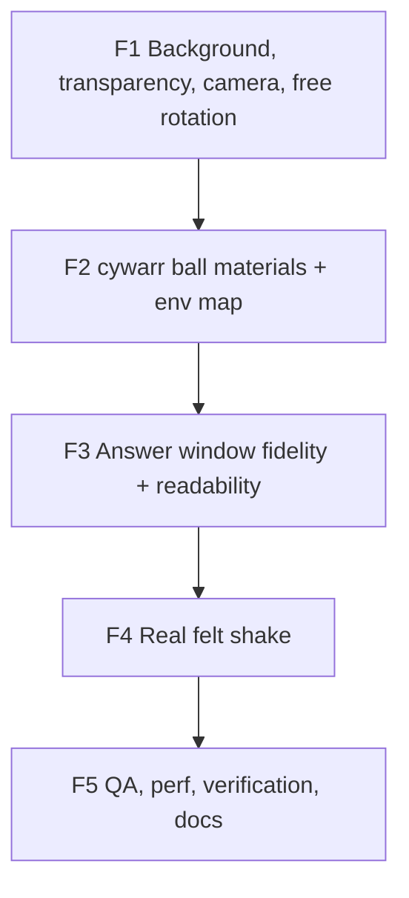

# Plan — Visual V5 ("cywarr Ball Fidelity")

> **Audience:** the **Coordinator** ([`prompts/COORDINATOR-VISUAL-V5-CYWARR-FIDELITY.md`](./prompts/COORDINATOR-VISUAL-V5-CYWARR-FIDELITY.md))
> and the phase implementer sub-agents it spawns. This is the single source of truth for the V5 visual
> fix. The phase table (§ 6 Fix plan) is the source of deliverables, acceptance, owned files, and locks.
> The cywarr ↔ ours comparison (§ 4 cywarr vs ours) holds every parameter every implementer copies into
> code.
>
> **Read order for a new agent:** [`README.md`](./README.md) → [`HANDOFF-VISUAL-V5-CYWARR-FIDELITY.md`](./HANDOFF-VISUAL-V5-CYWARR-FIDELITY.md) → this file (your phase row + § 4 cywarr vs ours).

V5 fixes the V4 render layer so the 3D ball **matches cywarr exactly**. State logic —
[`useOracleMachine`](../src/hooks/useOracleMachine.ts), [`useShake`](../src/hooks/useShake.ts),
[`OracleContext`](../src/context/OracleContext.tsx), themes, answers, audio, haptics — is **unchanged**.
The CSS fallback ([`MagikBall`](../src/components/MagikBall.tsx)) stays as the reduced-motion / no-WebGL
fallback. The cywarr reference (`Magic8Ball-main/js/main.js`, downloaded at repo root) is the parameter
source of truth.

---

## 1. Context — what we are fixing

V4 ([`PLAN-VISUAL-V4-CYWARR.md`](./PLAN-VISUAL-V4-CYWARR.md), F1–F5 merged) ported cywarr's geometry and
shader math, but the rendered result is wrong on real devices and in the user's screenshots: a white box
backdrop, a washed-out chrome/transparent ball, unreadable answer text, and an imperceptible shake. Four
verified root causes:

1. **White background — two compounding bugs.**
   - [`OracleScene.tsx`](../src/three/OracleScene.tsx) sets `<color attach="background" args={['transparent']} />`.
     `new THREE.Color('transparent')` is **not a valid color** — Three.js warns and leaves the color at its
     default **white**, so the canvas clears to white and `alpha: true` is defeated.
   - The camera `far: 50` clips the [`Background.tsx`](../src/three/Background.tsx) noise sphere
     (**radius 1000**, nearest surface ≈ 996 units away) entirely — the backdrop **never renders**, so the
     white clear shows through as the white box.

2. **White / chrome / "transparent" ball — wrong environment map.** The shell + lens are `metalness: 1`,
   so their visible color is *almost entirely the env-map reflection*. [`public/env/studio.jpg`](../public/env/studio.jpg)
   is a **high-key photo studio** (large white softboxes + white walls/floor, almost no dark area). A
   mirror-metal ball reflecting that reads as washed chrome with no form. cywarr reflects a **colorful,
   contrasty outdoor equirect** (`https://threejs.org/examples/textures/2294472375_24a3b8ef46_o.jpg`) whose
   dark foliage + bright sky give the deep-purple body and bright streaks. The env map is the dominant
   cause; the material recipe is otherwise close to cywarr.

3. **Weak shake.** V4 (F4) deleted all rotation; "shake" is only `timeScale 1→3` shimmer + optional
   ±0.01-unit / ±1° jitter ([`useOracleChoreography.ts`](../src/three/useOracleChoreography.ts)) — imperceptible.

4. **Unreadable answer / bad zoom.** [`AnswerPanel.tsx`](../src/three/AnswerPanel.tsx) uses
   `PlaneGeometry(0.4, 0.4)` on a radius-1 ball = **0.4× radius**. cywarr's panel is `3.2` on radius-4 =
   **0.8× radius** — our answer window (triangle, "8" rings, text) is **half the relative size**, hence tiny.
   Font is Oswald, not cywarr's Courier; ink/text are themed, not cywarr's cyan/orange.

5. **Constrained rotation.** [`OracleScene.tsx`](../src/three/OracleScene.tsx) `SceneControls` clamps
   `minPolarAngle 0.2π` / `maxPolarAngle 0.55π` and enables OrbitControls only in `idle`/`answered`. cywarr
   enables OrbitControls always with **no polar limits**. The user wants the free, unconstrained rotation.

> The user's screenshots are the **3D path** (the partial-sphere geometry + top dimple are unmistakably
> cywarr's), so `VITE_WEBGL` is on during testing. All fixes target the 3D path. Flipping `VITE_WEBGL=true`
> in production stays an overseer decision (post-F5).

---

## 2. Locked decisions (do not relitigate)

| Decision | Value |
|----------|-------|
| **Ball = faithful cywarr** | Reproduce cywarr's exact geometry, materials, env map, and answer window verbatim: indigo×5 shell, `0x000088` cavity, `0xaa0000` stripe sides, white glossy lens, cyan `(0,0.5,1)` triangle, orange `(1,0.5,0)` Courier text. **Per-pack re-theming is deferred — do not theme this track.** |
| **Env map** | cywarr's exact texture (`2294472375_24a3b8ef46_o.jpg`), **bundled locally** in `public/env/` — no runtime CDN dependency. Replaces `studio.jpg`. `sRGBColorSpace` + `EquirectangularReflectionMapping`. |
| **Background** | **Transparent canvas + dark glow.** Canvas transparent (rely on `alpha: true`); ball sits on the dark page; a subtle dark radial glow behind it for separation. The grey noise backdrop sphere is **removed**. |
| **Shake** | **Real felt shake** — transform-based translate + tilt on the ball group, ramp then settle to zero. **This overrides the V4 "no rotation choreography" lock — explicitly approved by the user.** |
| **Rotation** | **Free + unconstrained** orbit (remove polar clamp; `enablePan` off; damping on; enabled across phases) + a **drag-vs-tap guard** so a rotate-drag does not fire a shake. |
| **FSM contract** | Unchanged. `idle → shaking → revealing → answered → idle`. `onAnimationDone()` still fires at the end of the second opacity tween. |
| **CSS fallback** | Unchanged. Still kicks in for reduced-motion / low-power / no-WebGL / runtime errors. |
| **Merge policy** | Coordinator auto-merges each phase PR once CI is green. Pauses for the human only on a real decision or a merge conflict. |
| **Deploy** | Overseer-only. No agent runs Vercel CLI. |

---

## 3. Architecture — the integration seam

```
OracleStage (existing)
 ├─ useWebglCapability + VITE_WEBGL flag → CSS MagikBall
 └─ <Suspense fallback={<MagikBall renderingLocked />}>
      <OracleErrorBoundary>
        <OracleScene>                (F1: transparent, free orbit, drag-guard, dark glow)
          <Canvas alpha>
            <ambientLight />
            <Ball />                 (F2: cywarr materials + env map; F4: shake)
              <AnswerPanel />        (F3: cywarr-sized cyan/orange ink)
          </Canvas>                  (Background sphere REMOVED in F1)
        </OracleScene>
      </OracleErrorBoundary>
    </Suspense>
```

The reveal contract `useOracleChoreography(...)` continues to dispatch `onAnimationDone()` at the end of
`revealing`. Both renderers consume the same `OracleContext` machine and `OracleResult`.

---

## 4. cywarr vs ours — what we copy, what we adapt

All cywarr values from `Magic8Ball-main/js/main.js`. Our radius `R = 1` (cywarr `R = 4`); scale linear
sizes by `R/4`. Everywhere the two differ on the ball, we move to cywarr verbatim (colors deferred).

| Aspect | cywarr (R=4) | Ours target (R=1) | Current (wrong) | Phase |
|---|---|---|---|---|
| Shell geom | `SphereGeometry(4,200,100,0,2π,0.15π,0.85π)` + `shiftSphereSurface(true)` | `SphereGeometry(1,200,100,0,2π,0.15π,0.85π)` + shift | `128,64` segs | F2 |
| Inner shell | `g1.clone().scale(0.9,0.9,0.9)` | same | same ✓ | F2 |
| Sides bridge | `buildSides(g1)` | same | same ✓ | F2 |
| Lens geom | `SphereGeometry(3.99,200,25,0,2π,0,0.15π)` | `SphereGeometry(0.9975,200,25,0,2π,0,0.15π)` | `R-0.01,128,32` | F2 |
| Shell color | `new Color('indigo').addScalar(0.25).multiplyScalar(5)` | **same literal** | themed `shellColorForPack` | F2 |
| Shell material | `MeshStandardMaterial({ envMap, roughness:0.75, metalness:1 })` + FBM `onBeforeCompile` | same | same ✓ | F2 |
| Inner cavity | `MeshLambertMaterial({ color:0x000088, side:BackSide })` | `0x000088` BackSide | themed `fluidDeep` | F2 |
| Sides material | `MeshLambertMaterial({ color:0xaa0000 })` + sine-stripe `onBeforeCompile` | `0xaa0000` + same stripe shader (full amplitude) | themed `stripeShadow` grey, 0.4 amp | F2 |
| Lens material | `MeshStandardMaterial({ envMap, envMapIntensity:10, color:0xffffff, transparent:true, opacity:0.25, metalness:1, roughness:0 })` | same ✓ | same ✓ | — |
| Env map | threejs.org outdoor equirect, sRGB, Equirect | **bundle that exact texture** | `studio.jpg` (white studio) | F2 |
| Env binding | per-material `envMap` only; ambient light int 1 | per-material `envMap`; `scene.environment` optional | both | F2 |
| Camera | `PerspectiveCamera(60, asp, 0.1, 2000)` at `(0,1,0.375).setLength(15)` | `setLength(3.75)`, near 0.05, far 50 | same framing ✓ | — |
| Orbit | `enablePan false`, damping, **no polar limit**, zoom 8–15, always enabled | `enablePan false`, damping, **no polar limit**, zoom off, enabled all phases | polar `0.2π–0.55π`, idle-only | F1 |
| Backdrop | inverted sphere r1000, simplex-4D noise | **removed**; transparent canvas + CSS dark glow | broken (clipped → white) | F1 |
| Answer panel | `PlaneGeometry(0.4*8, 0.4*8)=3.2`, `rotateX(-π/2)`, ×4 instances, Y `0.75*4=3.0`, step `0.05` | `PlaneGeometry(0.8, 0.8)`, ×4, Y `0.75`, step `0.0125` | `PlaneGeometry(0.4)`, step `0.05` | F3 |
| Panel ink | `MeshBasicMaterial({ color:(0,0.5,1) cyan, opacity:0.9, blending:Additive })` + `tri()` SDF | same | themed `fluidHi` | F3 |
| Text tint | `text.rgb * vec3(1,0.5,0)` orange | `(1,0.5,0)` | themed `answerInk` (white) | F3 |
| Text canvas | 256², `bold 30px 'Courier New'`, white fill, transparent bg | same | `bold 30px Oswald` | F3 |
| Shake | none | **NEW**: translate ±0.06–0.12, tilt ±~0.08–0.15 rad (~6°), yoyo, settle to 0 | ±0.01 / ±1° (imperceptible) | F4 |
| Reveal | TWEEN baseVisibility 1→0.375 then textVisibility 0→1 | unchanged (V4) | unchanged ✓ | — |

### Reveal contract (unchanged from V4)

```
oracle phase      visual response
─────────────     ────────────────────────────────────────────────
idle              baseVisibility=1, textVisibility=0, timeScale=1.0
shaking (≈500ms)  timeScale → 3.0 + REAL transform shake (translate + tilt), then settle
revealing (600ms) tween A: baseVisibility 1 → 0.375 (300ms),
                  then chained tween B: textVisibility 0 → 1 (300ms, new text)
                  onComplete → onAnimationDone() → answered
answered          baseVisibility=0.375, textVisibility=1, timeScale=1.0
reset             textVisibility 1 → 0 (200ms), baseVisibility 0.375 → 1 (200ms) → idle
```

---

## 5. References

- **cywarr/Magic8Ball — `Magic8Ball-main/js/main.js`** (downloaded at repo root). The target. Single file.
  Geometry build (`g1+g2+g3+g4`), `shiftSphereSurface`, `buildSides`, FBM + Simplex-4D shader snippets,
  the ink panel's `tri(uv, N)` SDF, `createTextures`, the camera pose, OrbitControls config, and the
  material recipes are copied verbatim. The env texture URL is in the `textureLoader.loadAsync(...)` call.
- **Live demo** — `https://cywarr.github.io/Magic8Ball/` — the visual reference for flag-on QA.
- **Three.js metalness note** — for `metalness: 1` materials the visible color is the env-map reflection
  tinted by `color`; this is why the env map (not the base color) is the dominant cause of the white wash.

---

## 6. Fix plan

Five phases. Branch per phase: `fix/v5-<slug>`. One PR per phase. Coordinator auto-merges on green.
Strictly sequential F1 → F5.

### F1 — Background, transparency, camera, free rotation *(first; isolates the scene shell)*

- **Deliver:**
  - Delete the `<color attach="background" args={['transparent']} />` line in
    [`OracleScene.tsx`](../src/three/OracleScene.tsx). Rely on the `Canvas` `gl={{ alpha: true }}` so the
    canvas is genuinely transparent and the dark page shows through.
  - Stop rendering `<Background />` and **delete** [`Background.tsx`](../src/three/Background.tsx) (+ any
    test/import). The grey noise sphere is gone (it was clipped by `far` anyway).
  - Add a subtle dark **radial glow** behind the canvas — a CSS layer in the `OracleScene` stage container
    (or `index.css`): e.g. an absolutely-positioned div with `background: radial-gradient(circle at 50% 45%, color-mix(in oklch, var(--m8-fluid-deep) 40%, transparent) 0%, transparent 70%)`, low opacity, `pointer-events:none`, behind the canvas. Tune for separation without a visible box edge.
  - Remove `<ContactShadows />` from the canvas (it renders a grey smudge on the now-transparent ground;
    cywarr has none).
  - `SceneControls`: `<OrbitControls enableDamping enablePan={false} enableZoom={false} minPolarAngle={0} maxPolarAngle={Math.PI} enabled />` — **free unconstrained rotation, enabled in all phases**. Remove the `phase === 'idle' || 'answered'` gate and the polar clamp.
  - **Drag-vs-tap guard** on the ball `<button>`: record `pointerdown` x/y; on `pointerup`/click, if the
    pointer moved more than ~8px treat it as a rotate-drag and **do not** call `shakeOrTap()` / `reset()`.
    Keep keyboard activation (Enter/Space) firing the tap path.
  - Camera `far` may stay `50` (no backdrop sphere now). Keep fov 60, `(0,1,0.375).setLength(3.75)`.
- **Files (own / edit):** [`src/three/OracleScene.tsx`](../src/three/OracleScene.tsx),
  [`src/three/Background.tsx`](../src/three/Background.tsx) (delete) + its test/import,
  [`src/index.css`](../src/index.css) (glow) and/or [`src/components/OracleStage.tsx`](../src/components/OracleStage.tsx) (if the glow layer lives there).
- **Do not touch:** `Ball.tsx`, `AnswerPanel.tsx`, `useOracleChoreography.ts`, `Lighting.tsx`, FSM /
  context / data / shareExport / chrome.
- **Accept:** `tsc -b` + `npm run build` + `npm test` + `npm run test:e2e` green. With `VITE_WEBGL=true npm run dev`:
  no white box — the ball sits on the dark page with a soft glow; **drag rotates the ball freely in any
  direction** (touch + mouse) with no clamp; a quick **tap** still triggers the shake; a drag does **not**.
  Flag-off behaviour byte-for-byte unchanged.

### F2 — Faithful cywarr ball materials + env map *(after F1; the dominant visual fix)*

- **Deliver:**
  - **Bundle cywarr's exact env texture** locally: download
    `https://threejs.org/examples/textures/2294472375_24a3b8ef46_o.jpg` into `public/env/` (e.g.
    `public/env/cywarr-env.jpg`); **delete** `public/env/studio.jpg`. Update `ENV_MAP_PATH` in
    [`Lighting.tsx`](../src/three/Lighting.tsx) and the `useLoader.preload` in
    [`OracleScene.tsx`](../src/three/OracleScene.tsx). Keep `colorSpace = SRGBColorSpace`,
    `mapping = EquirectangularReflectionMapping`. Update `vite.config.ts` workbox precache glob if it
    pins the filename.
  - Rewrite [`Ball.tsx`](../src/three/Ball.tsx) materials to cywarr verbatim (drop the themed helpers
    `shellColorForPack`, `resolveStripeShadow`, and the `fluidDeep`/`stripeShadow` tints — colors deferred):
    - `[0] shell`: `MeshStandardMaterial({ envMap, color: new Color('indigo').addScalar(0.25).multiplyScalar(5), roughness: 0.75, metalness: 1 })`. **Keep** the existing FBM `onBeforeCompile` roughness shader (already cywarr).
    - `[1] cavity`: `MeshLambertMaterial({ color: 0x000088, side: BackSide })`.
    - `[2] sides`: `MeshLambertMaterial({ color: 0xaa0000 })` + the existing sine-stripe `onBeforeCompile` (already cywarr's math — just the literal red color, full amplitude `mix(col*0.5, col, l)`).
    - `[3] lens`: unchanged (already verbatim cywarr).
  - Geometry to cywarr segment counts: shell `SphereGeometry(1, 200, 100, …)`, lens `SphereGeometry(0.9975, 200, 25, …)`. If a real mobile-perf regression appears (measure), the implementer may keep `128×64`/`128×32` and note it in the handoff — do not silently downgrade.
- **Files (own / edit):** [`src/three/Ball.tsx`](../src/three/Ball.tsx),
  [`src/three/Lighting.tsx`](../src/three/Lighting.tsx),
  `public/env/cywarr-env.jpg` (add), `public/env/studio.jpg` (delete), `vite.config.ts` (only if it pins
  the env filename).
- **Do not touch:** `AnswerPanel.tsx` (F3), `useOracleChoreography.ts` (F4), `OracleScene.tsx` beyond the
  `ENV_MAP_PATH`/preload reference, FSM / context / chrome.
- **Accept:** `VITE_WEBGL=true npm run dev` → the ball reads as cywarr's **deep glossy purple/indigo** with
  visible form (dark body + bright purple/blue streaks), **not** white chrome. Side-by-side with
  `https://cywarr.github.io/Magic8Ball/` the ball body matches. tsc / build / test / e2e green. Flag-off
  byte-for-byte unchanged.

### F3 — Answer window fidelity + readability *(after F2)*

- **Deliver:**
  - [`AnswerPanel.tsx`](../src/three/AnswerPanel.tsx): `PlaneGeometry(0.8, 0.8)` (0.8× radius, matches
    cywarr's `3.2/4`); `INK_STEP = 0.0125`; `LENS_TOP_Y` stays `0.75`. Verify the `tri()` SDF uv scale frames
    the triangle + both "8" rings + the text correctly at the new size.
  - Ink color → `new Color(0, 0.5, 1)` cyan; `inkTextTint` → `(1, 0.5, 0)` orange (drop the themed
    `fluidHi` / `answerInk` resolves — colors deferred). Keep `AdditiveBlending`, `opacity: 0.9`, the
    `baseVisibility` / `textVisibility` / `isEasterEgg` uniforms, and the per-instance fade.
  - [`answerAtlas.ts`](../src/three/answerAtlas.ts): font → `bold 30px 'Courier New'` (monospace), white
    fill on transparent 256² canvas. Keep the per-phrase `CanvasTexture` map + keyed lookup.
  - Easter-egg amber tint path preserved.
- **Files (own / edit):** [`src/three/AnswerPanel.tsx`](../src/three/AnswerPanel.tsx),
  [`src/three/answerAtlas.ts`](../src/three/answerAtlas.ts) (+ their tests).
- **Do not touch:** `Ball.tsx`, `useOracleChoreography.ts`, `OracleScene.tsx`, FSM / context / chrome.
- **Accept:** When forced to `answered` (dev key / test harness), the lens shows a cyan triangle + "8" rings
  + the answer in orange Courier, **clearly readable** and cywarr-sized. Easter-egg amber visible when
  triggered. tsc / build / test / e2e green.

### F4 — Real felt shake *(after F3; overrides V4 no-rotation lock)*

- **Deliver:**
  - [`useOracleChoreography.ts`](../src/three/useOracleChoreography.ts): on `shaking`, animate the existing
    `jitterRef` `<group>` (in [`Ball.tsx`](../src/three/Ball.tsx)) with a **clearly perceptible** shake —
    `position` translate ±~0.06–0.12 and `rotation` tilt ±~0.08–0.15 rad (~6°), several rapid yoyo cycles,
    `ease` out, **settling to zero** so the lens cap returns to facing camera. Keep the `timeScale 1→3`
    shimmer. May raise `SHAKE_DURATION_MS` (~500–600 ms) if needed for feel — note it in the handoff.
  - Reveal opacity tweens and `onAnimationDone()` timing unchanged.
  - **Reduced motion:** skip the shake transform (instant), still dispatch `onAnimationDone()`.
  - Confirm free orbit (camera) and the shake (ball group) coexist without fighting.
- **Files (own / edit):** [`src/three/useOracleChoreography.ts`](../src/three/useOracleChoreography.ts),
  [`src/three/oracleChoreography.test.ts`](../src/three/oracleChoreography.test.ts).
- **Do not touch:** `Ball.tsx` materials/geometry, `AnswerPanel.tsx`, `OracleScene.tsx`, FSM / context /
  `AnswerTriangle.tsx`.
- **Accept:** tap → the ball **visibly shakes** (translate + tilt) and shimmer speeds up, then settles and
  the answer reveals; reveal/answered/reset unchanged. Reduced-motion: no shake, FSM still progresses.
  e2e green.

### F5 — QA, perf, verification, docs *(after F4)*

- **Deliver:**
  - `npx tsc -b` · `npm run build` · `npm test` · `npm run test:e2e` · `/code-review` on the full diff.
  - Flag-on visual QA vs `https://cywarr.github.io/Magic8Ball/`: deep glossy purple ball, cyan/orange
    readable answer, transparent dark backdrop with glow, free unconstrained rotation on touch, felt shake.
  - Flag-off regression: `VITE_WEBGL` unset → CSS ball + tap reveal byte-for-byte unchanged.
  - `npm run test:lighthouse` within budgets (flag-off ≥85, flag-on ≥50). Confirm the bundled env texture
    size is reasonable; DPR caps unchanged.
  - Mark [`PLAN-VISUAL-V4-CYWARR.md`](./PLAN-VISUAL-V4-CYWARR.md) /
    [`HANDOFF-VISUAL-V4-CYWARR.md`](./HANDOFF-VISUAL-V4-CYWARR.md) **superseded** by V5; finalize the V5
    handoff with pinned versions + a flag-on QA checklist.
- **Files (own / edit):** `package.json` / `vite.config.ts` (only if needed), `e2e/webgl.spec.ts` +
  `e2e/__snapshots__/*`, `docs/PLAN-VISUAL-V4-CYWARR.md`, `docs/HANDOFF-VISUAL-V4-CYWARR.md`,
  `docs/PLAN-VISUAL-V5-CYWARR-FIDELITY.md`, `docs/HANDOFF-VISUAL-V5-CYWARR-FIDELITY.md`,
  `scripts/lighthouse.mjs` (thresholds if needed).
- **Do not touch:** any `src/three/*` rendering file F1–F4 already shipped.
- **Accept:** Full QA green; ball matches cywarr; readable answer; transparent dark backdrop; free rotation;
  felt shake; flag-off unchanged; Lighthouse within budget; docs updated.

---

## 7. Dependency graph & locks



- Strictly sequential. F2 (ball) gates F3's answer-window visual check; F4 shakes the group F2/F3 build.
- **Never two agents on the same file.** Per-phase ownership is the `Files you OWN` block in each phase row.
  The coordinator records active ownership in
  [`HANDOFF-VISUAL-V5-CYWARR-FIDELITY.md`](./HANDOFF-VISUAL-V5-CYWARR-FIDELITY.md) § Active locks before
  spawning.

## 8. Risk register

| Risk | Mitigation |
|------|------------|
| Pure-black page → dark purple ball disappears | F1 dark radial glow gives separation; tune opacity. |
| cywarr env texture license / availability | It's the standard three.js example asset (long-lived). Bundle a local copy; if unavailable, coordinator asks the user for a substitute contrasty equirect. |
| 200×100 segments hurt mobile perf | DPR is already capped (V4 F5). Measure; allow `128×64` fallback with a handoff note. |
| Shake (transform) fights free orbit | Orbit moves the camera; shake moves the ball group — independent. F4 verifies. |
| Drag-vs-tap guard breaks keyboard / a11y | Guard only the pointer path; keep Enter/Space firing the tap; preserve `aria-label` + aria-live. |
| Removing ContactShadows flattens the ball | The env-map reflection + glow carry the form (cywarr has no contact shadow). |

## 9. Verification (each phase + final)

- **Per phase:** `tsc -b` · `npm run build` · `npm test` · `npm run test:e2e` · `/code-review` on the diff · open PR via `gh`.
- **Flag-off regression:** `VITE_WEBGL` unset → CSS-ball behaviour byte-for-byte unchanged.
- **Flag-on after F4:** `VITE_WEBGL=true npm run dev`, compared with `https://cywarr.github.io/Magic8Ball/` —
  deep glossy purple ball, readable cyan/orange answer, transparent dark backdrop + glow, free rotation,
  felt shake, then reveal.
- **Reduced motion:** shake skipped (instant); answer still reveals; `onAnimationDone()` fires.
- **Final (F5):** Lighthouse within budget; e2e green on both paths; aria-live answer preserved.

## 10. Conventions

- **Branch:** `fix/v5-<slug>` (e.g. `fix/v5-f1-bg-orbit`). `main` stays deployable.
- **PR:** one per phase, opened with `gh pr create`; body links the phase + ticked acceptance checklist.
- **Commits:** `[Type]: [what] (Fx)` (e.g. `Fix: transparent canvas + free orbit (F1)`).
- **No deploy by agents.** No `--no-verify`. No force-push to `main`. Stage specific files.
- **Handoff block:** returned by every implementer, copied into
  [`HANDOFF-VISUAL-V5-CYWARR-FIDELITY.md`](./HANDOFF-VISUAL-V5-CYWARR-FIDELITY.md) — see the coordinator
  prompt's § Handoff template.

### Phase slugs / branches

| Phase | Slug / branch |
|-------|----------------|
| F1 | `fix/v5-f1-bg-orbit` |
| F2 | `fix/v5-f2-ball-env` |
| F3 | `fix/v5-f3-answer` |
| F4 | `fix/v5-f4-shake` |
| F5 | `fix/v5-f5-qa` |
