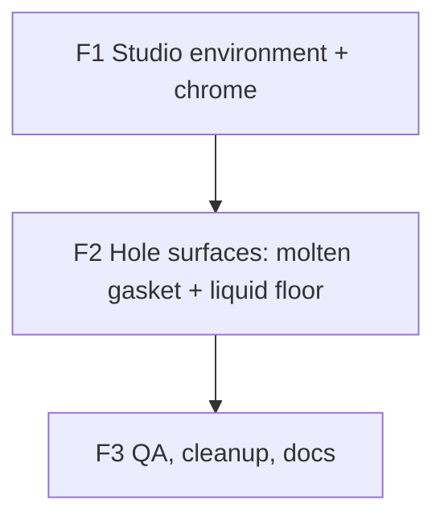

# Plan — Visual V6 ("Studio Chrome")

> **Audience:** the **Coordinator** ([`prompts/COORDINATOR-VISUAL-V6-STUDIO-CHROME.md`](./prompts/COORDINATOR-VISUAL-V6-STUDIO-CHROME.md))
> and the phase implementer sub-agents it spawns. This is the single source of truth for the V6 visual
> overhaul. The phase table (§ 6 Fix plan) is the source of deliverables, acceptance, owned files, and
> locks. The current↔target comparison (§ 4 Current vs Target) holds every parameter every implementer
> copies into code.
>
> **Read order for a new agent:** [`README.md`](./README.md) → [`HANDOFF-VISUAL-V6-STUDIO-CHROME.md`](./HANDOFF-VISUAL-V6-STUDIO-CHROME.md) → this file (your phase row + § 4 Current vs Target).

V6 keeps V5's geometry, the four-material recipe, the FBM surface shader, the answer window
(triangle / "8" / Courier text), the shake choreography, and the FSM **unchanged**. It changes only how
the ball is **lit and toned**, plus a recolor of the hole's rim (gasket) and a subtle depth pass on the
hole floor. The reference for *intent* is cywarr (`Magic8Ball-main/js/main.js`, repo root); the reference
for *direction* is the user's own choices (§ 2).

---

## 1. Context — what we are fixing

V5 (`PLAN-VISUAL-V5-CYWARR-FIDELITY.md`, F1–F5 merged) made the ball a faithful cywarr port. But the
shipped ball reads **dingy / coppery / "unnatural"** in the user's screenshots, while both the cywarr
live demo and the user's stated taste want a **bright violet/chrome, shiny, mystic** ball. Root cause,
verified by reading the render layer + opening the asset:

1. **The shell is a mirror, and the mirror reflects a dark brown room.**
   The shell + lens are `metalness: 1`, so their visible colour is *almost entirely the env-map
   reflection*, only tinted by `color`. Our bundled env map
   [`public/env/cywarr-env.jpg`](../public/env/cywarr-env.jpg) is a **dark, desaturated "abandoned
   room" equirect** (dim brown interior, two small bright windows). A mirror-metal ball reflecting that
   reads as a dark brown/coppery orb — the warm glints are the windows. This is the dominant cause.
   - *Note:* the filename is misleading. The real cywarr demo loads a **bright** outdoor panorama
     (`https://threejs.org/examples/textures/2294472375_24a3b8ef46_o.jpg`) over a mid-grey backdrop, so
     its mirror reflects brightness → vivid violet. V5 bundled a different, much darker file under the
     `cywarr-env.jpg` name.

2. **ACES tone-mapping desaturates.** [`OracleScene.tsx`](../src/three/OracleScene.tsx) uses
   `ACESFilmicToneMapping` at exposure 1.0. ACES is well-documented to wash out saturation — it mutes the
   violet/amber we want.

3. **The page is near-black, so the lower hemisphere mirrors black.** The ball never reads as a complete,
   lit object; the bottom dies into the background.

4. **The rim "gasket" exists but is muddy.** The `sides` material (`0xaa0000` red Lambert + sine-stripe
   shader — the "shaky wavy lines" the user pointed at in the reference) is correct in code but, under the
   dark env + ACES, reads as an indistinct dark band rather than a defined seam.

**Conclusion:** the materials/geometry are already right. The fix is **environment + tone-mapping**, plus
a deliberate recolor of the gasket and a subtle depth pass on the hole floor. We do **not** re-create the
cywarr photo backdrop (it clashes with the app's dark terminal UI) — instead we *design* the reflections
with a procedural studio so the ball glows out of darkness, on-brand.

> The user's screenshots are the 3D path (`VITE_WEBGL=true`). All fixes target the 3D render layer. The
> CSS fallback ([`MagikBall`](../src/components/MagikBall.tsx)) and the prod flag flip stay as-is.

---

## 2. Locked decisions (do not relitigate — confirmed with the user)

| Decision | Value |
|----------|-------|
| **Look & mood** | **Dark mystic studio.** Keep the app's near-black backdrop; the ball is lit by a *designed* studio of coloured light-strips so it reads as bright chrome glowing out of darkness. Do **not** re-introduce a photographic/grey backdrop. |
| **Reflection palette** | **Amber/gold + violet.** Violet is the dominant tint; warm amber/gold provides molten highlight streaks (ties to the app's amber UI accent). |
| **Gasket rim** | **Molten amber/copper.** Recolor the existing `sides` material from red to glowing copper; **keep** the sine-stripe ("wavy lines") shader math. |
| **Hole floor** | **Subtle liquid depth.** Keep the deep-blue cavity but add a faint radial gradient (darker rim, slightly luminous centre) + slow shimmer so it feels like fluid behind glass. Must never compete with the answer text. |
| **Env technique** | **Procedural drei `<Environment>` + `<Lightformer>`** (baked once), not a photo HDRI. Removes the runtime asset; gives full control of the reflections. `@react-three/drei@10.7.7` already installed. |
| **Tone mapping** | **`NeutralToneMapping`** (Khronos PBR Neutral — best saturation retention) at exposure ~1.1. **A/B fallback:** `AgXToneMapping` if Neutral feels flat. (Was `ACESFilmicToneMapping`.) |
| **Untouched** | AnswerPanel (triangle / "8" / Courier text), `answerAtlas.ts`, geometry builders (`shiftSphereSurface`, `buildSides`, `buildCywarrBallGeometry`), the shell FBM roughness shader, the shake choreography, and the FSM. |
| **CSS fallback** | Unchanged. Still kicks in for reduced-motion / low-power / no-WebGL / runtime errors. |
| **Branch / merge policy** | **Integration branch.** All phases land on `visual/v6-studio-chrome`, *not* `main`. Coordinator squash-merges each phase PR into the integration branch and pushes it. The human merges the integration branch → `main` at the very end (post-F3). See § 10. |
| **Deploy** | Overseer-only. No agent runs Vercel/Cloudflare CLI. |

---

## 3. Architecture — the integration seam

```
OracleStage (existing, VITE_WEBGL-gated)
 └─ <Suspense> <OracleErrorBoundary>
      <OracleScene>                 (F1: NeutralToneMapping + exposure; drop env preload)
        <Canvas alpha>
          <Lighting />              (F1: drei <Environment> + <Lightformer> rig replaces the HDRI;
                                        sets scene.environment; dim cool ambient)
          <Ball />                  (F1: shell uses scene.environment + pale-violet tint;
                                        F2: molten gasket, dimmer lens, liquid-floor cavity)
            <AnswerPanel />         (UNTOUCHED — triangle / 8 / Courier text)
          <Effects />               (no-op, unchanged)
        </Canvas>
      </OracleErrorBoundary> </Suspense>
```

Key mechanic: at `metalness: 1`, a `MeshStandardMaterial` with **no explicit `envMap`** automatically
uses `scene.environment`. drei `<Environment>` (with `<Lightformer>` children) PMREM-processes its baked
cube into `scene.environment`, so the shell's `roughness: 0.75` blurs it into soft chrome correctly. We
therefore **remove the per-material `envMap` assignment** and the `TextureLoader` HDRI entirely.

The reveal contract `useOracleChoreography(...)` is unchanged; both renderers consume the same
`OracleContext`.

---

## 4. Current vs Target — what we change, with exact parameters

> This is the parameter source of truth. Implementers copy these values verbatim. R = ball radius = 1.
> Current values are from `src/three/{Ball,Lighting,OracleScene}.tsx` (read them in your phase).

### 4.1 Environment & tone mapping (F1)

| Aspect | Current | Target | Phase |
|---|---|---|---|
| Env source | `useLoader(TextureLoader, '/env/cywarr-env.jpg')` in `Lighting.tsx` **and** `Ball.tsx`; `scene.environment = tex`; per-material `envMap: envTex` on shell + lens | **Procedural** drei `<Environment frames={1} resolution={256} background={false} environmentIntensity={1}>` with the Lightformer rig below. **No** `TextureLoader`, **no** `ENV_MAP_PATH`, **no** per-material `envMap`. | F1 |
| Env binding | per-material `envMap` (overrides scene.environment) | rely on `scene.environment` fallback (shell/lens have **no** `envMap`) | F1 |
| Ambient | `<ambientLight intensity={1.0} />` (white) | `<ambientLight intensity={0.5} color="#6a6280" />` (dim cool — lifts the Lambert gasket/cavity without flattening the mood) | F1 |
| Tone mapping | `ACESFilmicToneMapping`, exposure `1.0` | `NeutralToneMapping`, exposure `1.1` (A/B fallback `AgXToneMapping`) | F1 |
| Preload | `useLoader.preload(TextureLoader, ENV_MAP_PATH)` in `OracleScene.tsx` | removed (+ remove now-unused `TextureLoader`/`ENV_MAP_PATH` imports) | F1 |

**Lightformer studio rig** (children of `<Environment>` in `Lighting.tsx`). Seed values — tune live;
keep the *roles* and palette. All `target={[0,0,0]}` unless noted.

| Role | form | color | intensity | scale | position | rotation |
|---|---|---|---|---|---|---|
| Violet KEY (dominant tint) | `rect` | `#7a4bff` | `2.2` | `[6,6,1]` | `[-2, 3, 3]` | — |
| Amber/gold KICKER (molten streak) | `rect` | `#ffb24a` | `3.0` | `[3,5,1]` | `[3, 1.5, 2]` | — |
| Magenta FILL / rim | `rect` | `#ff3ea5` | `1.3` | `[4,4,1]` | `[2.5, -1, -3]` | — |
| White SPEC sparkle | `circle` | `#ffffff` | `4.0` | `[1,1,1]` | `[-1.5, 2.5, 1.5]` | — |
| Cool-violet FLOOR fill (kills the black-bottom) | `rect` | `#3a2d6b` | `0.6` | `[8,8,1]` | `[0, -4, 0]` | `[-Math.PI/2, 0, 0]` (no target; faces up) |

### 4.2 Shell / chrome (F1)

| Aspect | Current | Target | Phase |
|---|---|---|---|
| Shell color (F0 tint at metalness 1) | `new Color('indigo').addScalar(0.25).multiplyScalar(5)` (heavy violet → would pink-shift amber) | **`new Color(0.85, 0.78, 1.0)`** (pale violet-silver: amber reads amber, violet reads violet, violet bias in shadows) — tune | F1 |
| Shell `metalness` / `roughness` | `1` / `0.75` | unchanged | — |
| Shell `envMapIntensity` | default `1` | `1.2` (optional brighten) — tune | F1 |
| Shell FBM roughness shader | `onBeforeCompile` (CYWARR_FBM) | **unchanged** | — |

### 4.3 Hole rim (gasket / `sides`) (F2)

| Aspect | Current | Target | Phase |
|---|---|---|---|
| Base `color` | `0xaa0000` (red) | **`0xc8631e`** molten copper — tune | F2 |
| `emissive` | none | **warm amber** `new Color(0xff7a1a)`, low `emissiveIntensity` (~`0.3`) so the seam *glows* independent of env — tune | F2 |
| Sine-stripe `onBeforeCompile` ("wavy lines") | `wUv.y*=5; wUv.y += sin(uv.x*PI2*100.)*0.04; mix(col*0.5, col, l)` | **keep the math**; optionally warm the ridge highlight (e.g. tint the bright `col` slightly hotter) | F2 |

### 4.4 Lens (top rim glint) (F2)

| Aspect | Current | Target | Phase |
|---|---|---|---|
| `envMapIntensity` | `10` | **`2.5`** (the brighter studio env would blow out the rim at 10) — tune | F2 |
| color / metalness / roughness / opacity | `0xffffff` / `1` / `0` / `0.25` | unchanged | — |

### 4.5 Hole floor (cavity) (F2)

| Aspect | Current | Target | Phase |
|---|---|---|---|
| Material | `MeshLambertMaterial({ color: 0x000088, side: BackSide })`, flat | keep base + **add `defines = { USE_UV: '' }` and an `onBeforeCompile`** | F2 |
| Depth | none | **radial gradient**: pass local `vPos` (same pattern as shell); compute horizontal radius from the hole's vertical axis; darken `diffuseColor` toward the rim, lift it faintly at centre | F2 |
| Shimmer | none | **low-amplitude** `fbm(vPos + vec3(0, time*0.2, 0))` (reuse `CYWARR_FBM` + the shared `oracleSceneTime` uniform from `oracleSceneClock.ts`) modulating brightness by a few % | F2 |
| Constraint | — | keep amplitudes subtle; the cavity sits **behind** `AnswerPanel` and must not compete with the text | F2 |

### 4.6 Cleanup (F3)

| Aspect | Current | Target | Phase |
|---|---|---|---|
| `public/env/cywarr-env.jpg` (748 KB) | bundled, precached | **delete** (dead after F1) + confirm no refs (`Lighting.tsx`, `OracleScene.tsx`, `vite.config.ts` workbox glob) | F3 |
| V5 docs | `status: complete` | mark **superseded** by V6 | F3 |

---

## 5. References

- **Three.js metalness note** — for `metalness: 1`, visible colour ≈ env reflection tinted by `color`; this
  is why the env map, not the base colour, is the dominant cause of the dingy look.
- **drei `<Environment>` / `<Lightformer>`** — `https://drei.docs.pmnd.rs/staging/environment` and
  `.../staging/lightformer`. `<Lightformer form="rect|circle|ring" intensity color scale position rotation
  target>` draws flat emissive shapes baked into the env cube; PMREM handles the blur for rough metals.
- **Tone mapping** — `NeutralToneMapping` (Khronos PBR Neutral) preserves saturation best for vibrant
  colour; ACES desaturates; AgX is the flatter cinematic fallback. (`three` 0.184 ships all three.)
- **cywarr/Magic8Ball — `Magic8Ball-main/js/main.js`** (repo root) — the geometry/material recipe V5
  already ported; unchanged in V6. The env URL it loads (`2294472375_24a3b8ef46_o.jpg`) is the *bright*
  reference our V5 bundle diverged from.
- **shared clock** — `src/three/oracleSceneClock.ts` exports `oracleSceneTime` (used by the shell shader;
  reuse for the cavity shimmer).

---

## 6. Fix plan

Three phases. Strictly sequential F1 → F2 → F3. Branch per phase **off the integration branch**:
`v6/<slug>`. One PR per phase, `--base visual/v6-studio-chrome`. Coordinator squash-merges into the
integration branch on green.

### F1 — Studio environment + chrome *(first; the dominant visual fix)*

- **Objective:** replace the dark photo-HDRI with a procedural Lightformer studio so the shell becomes
  bright amber+violet chrome on the dark page, and switch tone-mapping for saturation.
- **Deliver (copy § 4.1 + § 4.2 verbatim):**
  - [`Lighting.tsx`](../src/three/Lighting.tsx): remove the `TextureLoader`/`scene.environment`/`ENV_MAP_PATH`
    logic. Render `<Environment frames={1} resolution={256} background={false} environmentIntensity={1}>`
    with the **five Lightformers** from § 4.1 (violet key, amber kicker, magenta fill, white spec, cool
    floor fill). Set `<ambientLight intensity={0.5} color="#6a6280" />`. Keep the exported component name
    `Lighting`. Remove the `ENV_MAP_PATH` export.
  - [`Ball.tsx`](../src/three/Ball.tsx): remove `useLoader(TextureLoader, ENV_MAP_PATH)`, the `envTex`
    `useEffect`, and the `envMap: envTex` prop on **shell** and **lens** (they now use
    `scene.environment`). Change the **shell** `color` to `new Color(0.85, 0.78, 1.0)` and (optional)
    `envMapIntensity: 1.2`. **Keep** the FBM `onBeforeCompile`. **Do not** change `sides`/`cavity`/`lens`
    colours/shaders here — those are F2 (you only remove `lens.envMap`; leave `lens.envMapIntensity` for
    F2).
  - [`OracleScene.tsx`](../src/three/OracleScene.tsx): `toneMapping: NeutralToneMapping`,
    `gl.toneMappingExposure = 1.1`. Remove the `useLoader.preload(TextureLoader, ENV_MAP_PATH)` line and
    the now-unused `TextureLoader` / `ENV_MAP_PATH` imports. (If Neutral looks flat, try `AgXToneMapping`
    and note the choice in the handoff.)
- **Files (own / edit):** `src/three/Lighting.tsx`, `src/three/OracleScene.tsx`, `src/three/Ball.tsx`.
- **Do NOT edit:** `AnswerPanel.tsx`, `answerAtlas.ts`, `useOracleChoreography.ts`, geometry builders, the
  FBM shader body, FSM / context / `MagikBall.tsx`. Do not delete `public/env/cywarr-env.jpg` yet (F3).
- **Accept:** `tsc -b` + `npm run build` + `npm test` + `npm run test:e2e` green. With
  `VITE_WEBGL=true VITE_WEBGL_E2E=true npm run dev` (or build+preview): the shell reads as **bright violet
  chrome with amber/gold + violet highlights**, not coppery/muddy; **drag-rotate** → reflections sweep and
  the lower hemisphere is no longer pure black; **tap/shake** still animates the FBM ripple; reveal works.
  Flag-off (`VITE_WEBGL` unset) byte-for-byte unchanged. `/code-review` clean.

### F2 — Hole surfaces: molten gasket + liquid floor *(after F1)*

- **Objective:** make the rim read as a glowing molten amber/copper seam and give the hole floor subtle
  liquid depth.
- **Deliver (copy § 4.3 + § 4.4 + § 4.5 verbatim):**
  - **Gasket** (`sides`): base `color` → `0xc8631e`; add `emissive: new Color(0xff7a1a)`,
    `emissiveIntensity: 0.3`. **Keep** the sine-stripe `onBeforeCompile`; optionally warm the ridge
    highlight. Stays `MeshLambertMaterial`.
  - **Lens**: `envMapIntensity` `10` → `2.5`.
  - **Cavity** (floor): add `defines = { USE_UV: '' }` + `onBeforeCompile` — pass local `vPos`; radial
    gradient (darker rim, faint centre lift); low-amplitude `fbm(vPos + vec3(0, time*0.2, 0))` shimmer
    using `CYWARR_FBM` + the shared `oracleSceneTime` uniform. Keep it subtle (behind the text).
- **Files (own / edit):** `src/three/Ball.tsx` (the `sides`, `lens`, and `cavity` material blocks only —
  shell + env wiring are F1, frozen).
- **Do NOT edit:** the shell material / env wiring (F1), `Lighting.tsx`, `OracleScene.tsx`,
  `AnswerPanel.tsx`, geometry builders, choreography, FSM / context.
- **Accept:** `VITE_WEBGL=true …` dev/preview → the **molten amber/copper gasket** with wavy lines clearly
  rings the hole (was muddy/invisible); the **hole floor** shows a faint radial gradient + slow shimmer
  behind the answer; the triangle / "8" / text remain crisp and **unchanged**. tsc / build / test / e2e
  green; flag-off unchanged; `/code-review` clean.

### F3 — QA, cleanup, docs *(after F2)*

- **Objective:** verify the full overhaul, drop the dead asset, supersede V5, finalize V6 — all still on
  the integration branch.
- **Deliver:**
  - `npx tsc -b` · `npm run build` · `npm test` · `npm run test:e2e` · `/code-review` on the full
    integration diff.
  - **Delete** `public/env/cywarr-env.jpg`; confirm nothing references it (`Lighting.tsx`,
    `OracleScene.tsx`, `vite.config.ts` workbox precache glob) — fix any dangling ref/glob.
  - Flag-on QA (dev/preview): bright violet chrome w/ amber+violet highlights, molten gasket, liquid
    floor, free rotation, felt shake, readable cyan/orange answer.
  - Flag-off regression: `VITE_WEBGL` unset → CSS ball + tap reveal byte-for-byte unchanged.
  - `npm run test:lighthouse` within budgets (flag-off ≥85; flag-on floor 45 per V5 — bundle should
    *shrink* by ~748 KB once the env jpg is gone).
  - Mark `PLAN-VISUAL-V5-CYWARR-FIDELITY.md` / `HANDOFF-VISUAL-V5-CYWARR-FIDELITY.md` **superseded** by V6;
    finalize `HANDOFF-VISUAL-V6-STUDIO-CHROME.md` (pinned versions, QA table, flag-on checklist).
- **Files (own / edit):** `public/env/cywarr-env.jpg` (delete), `vite.config.ts` (only if it pins the env
  glob), `scripts/lighthouse.mjs` (only if thresholds need adjustment), `docs/PLAN-VISUAL-V5-CYWARR-FIDELITY.md`,
  `docs/HANDOFF-VISUAL-V5-CYWARR-FIDELITY.md`, `docs/PLAN-VISUAL-V6-STUDIO-CHROME.md`,
  `docs/HANDOFF-VISUAL-V6-STUDIO-CHROME.md`.
- **Do NOT edit:** any `src/three/*` rendering file F1–F2 shipped.
- **Accept:** full QA green; env jpg gone with no dangling refs; Lighthouse within budget; V5 superseded;
  V6 handoff finalized. The integration branch `visual/v6-studio-chrome` is ready for the human to merge
  → `main`.

---

## 7. Dependency graph & locks



- Strictly sequential. F1 establishes the env every later visual check depends on; F2 refines the hole
  surfaces F1 lit; F3 verifies + cleans up.
- **`Ball.tsx` is edited by both F1 (shell + env wiring) and F2 (sides + lens + cavity).** This is fine
  *sequentially* — the coordinator locks `Ball.tsx` for F1, releases it on merge, re-locks it for F2 (the
  same way V5 cycled `OracleScene.tsx` across phases). **Never two agents on `Ball.tsx` at once.**
- Per-phase ownership is the `Files you OWN` block in each phase row; the coordinator records active
  ownership in `HANDOFF-VISUAL-V6-STUDIO-CHROME.md` § Active locks before spawning.

## 8. Risk register

| Risk | Mitigation |
|------|------------|
| Materials don't pick up `scene.environment` after dropping `envMap` | `MeshStandardMaterial` uses `scene.environment` when `material.envMap` is null — standard behaviour. If a material stays dark, assign the drei env texture explicitly. F1 verifies live. |
| Violet shell tint pink-shifts the amber highlights | Tint is desaturated to pale violet-silver (§ 4.2) precisely so the coloured lights carry their own hue; tune the tint if amber still skews. |
| `NeutralToneMapping` feels flat | A/B with `AgXToneMapping`; pick the better one and log it in the Decisions log. |
| Lower hemisphere still black | The cool-violet floor Lightformer fills it; raise its intensity/scale if needed. |
| Lens at the new bright env blows out | F2 drops `envMapIntensity` 10 → 2.5; tune. |
| Cavity shimmer competes with the answer text | Keep amplitude to a few %; it sits behind `AnswerPanel`. F2 verifies text readability. |
| Lighthouse flag-on regression | Env now bakes once at 256² (cheap) and the 748 KB jpg is removed → expect neutral-to-better. Measure in F3. |
| e2e breakage from visual change | Flag-on e2e is **behavioral/DOM, not pixel-snapshot** (verified — no `toHaveScreenshot`), so material changes don't break it. |

## 9. Verification (each phase + final)

- **Per phase:** `tsc -b` · `npm run build` · `npm test` · `npm run test:e2e` · `/code-review` on the diff
  · open PR via `gh` `--base visual/v6-studio-chrome`.
- **Flag-off regression:** `VITE_WEBGL` unset → CSS-ball behaviour byte-for-byte unchanged.
- **Flag-on (F1 onward):** `VITE_WEBGL=true VITE_WEBGL_E2E=true` build+preview (or dev) — bright violet
  chrome with amber+violet highlights; from F2: molten gasket + liquid floor; free unconstrained rotation;
  felt shake; readable cyan/orange answer.
- **Reduced motion:** shake skipped (instant); answer still reveals; `onAnimationDone()` fires.
- **Final (F3):** Lighthouse within budget; e2e green on both paths; aria-live answer preserved; env jpg
  removed; docs updated.

## 10. Conventions

- **Integration branch:** `visual/v6-studio-chrome` (off `main`). **`main` is NOT touched until the very
  end.** All phase work merges into the integration branch.
- **Phase branch:** `v6/<slug>` (e.g. `v6/f1-studio-env`) **off `visual/v6-studio-chrome`**.
- **PR:** one per phase, `gh pr create --base visual/v6-studio-chrome --head v6/<slug>`; body links the
  phase + ticked acceptance checklist.
- **Merge:** coordinator `gh pr merge <PR> --squash --delete-branch` **into the integration branch**, then
  `git push origin visual/v6-studio-chrome`. After F3 + sign-off, the **human** merges the integration
  branch → `main` and pushes for deploy.
- **Commits:** `[Type]: [what] (Fx)` (e.g. `Light: procedural studio env + neutral tone map (F1)`).
- **No deploy by agents.** No `--no-verify`. No force-push. Stage specific files.
- **Handoff block:** returned by every implementer, copied into
  `HANDOFF-VISUAL-V6-STUDIO-CHROME.md` — see the coordinator prompt's handoff template.

### Phase slugs / branches

| Phase | Slug / branch | Base |
|-------|----------------|------|
| F1 | `v6/f1-studio-env` | `visual/v6-studio-chrome` |
| F2 | `v6/f2-hole-surfaces` | `visual/v6-studio-chrome` |
| F3 | `v6/f3-qa-cleanup` | `visual/v6-studio-chrome` |
