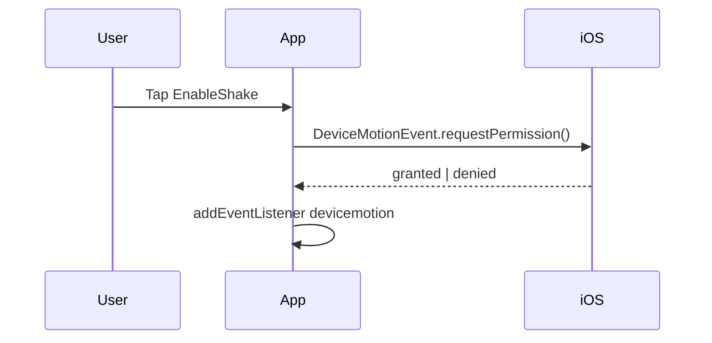

# SENSORS — Shake Detection & Fallbacks

Primary input: **device shake** via Device Motion API. See [ARCHITECTURE.md](./ARCHITECTURE.md) for hook location.

## Requirements covered

- REQ-030, REQ-031, REQ-032, REQ-033

## Algorithm (REQ-030)

Use `devicemotion` with **accelerationIncludingGravity** (m/s²).

```ts
const x = event.accelerationIncludingGravity?.x ?? 0;
const y = event.accelerationIncludingGravity?.y ?? 0;
const z = event.accelerationIncludingGravity?.z ?? 0;

// Default (FIX-3): hypot magnitude + jerk vs rolling baseline
const magnitude = Math.hypot(x, y, z);
```

| Parameter | Default | Tune in |
|-----------|---------|---------|
| `SHAKE_THRESHOLD` | `18` | `useShake` options |
| `SHAKE_COOLDOWN_MS` | `2000` | `useShake` options |
| `SHAKE_SPIKE_DELTA` | `5` | `useShake` options |
| Sustained samples (complete shake) | `3` (~99ms) | `useShake` options |
| Sample throttle | ~30 Hz (`33ms`) | listener wrapper |

**Start ritual:** `magnitude > THRESHOLD`, spike `magnitude - baseline >= SPIKE_DELTA`, and `now - lastShake > COOLDOWN`.

**Complete shake:** same spike vs ritual baseline for `3` consecutive throttled samples (no first-frame fire).

## Permission flow (REQ-031)



| Platform | Behavior |
|----------|----------|
| iOS Safari 13+ | Must call `DeviceMotionEvent.requestPermission()` from **click** handler |
| Android Chrome | Usually no prompt; still requires HTTPS |
| Desktop | Often no motion; show tap fallback only |

```ts
async function requestMotionPermission(): Promise<'granted' | 'denied' | 'unsupported'> {
  if (typeof DeviceMotionEvent === 'undefined') return 'unsupported';
  if (typeof DeviceMotionEvent.requestPermission !== 'function') return 'granted';
  const result = await DeviceMotionEvent.requestPermission();
  return result === 'granted' ? 'granted' : 'denied';
}
```

**UX-005 copy:** "Magik 8 uses motion to feel your shake. Tap to allow — we never store sensor data."

On **denied**: hide shake hint; emphasize **ShakeCTA** button; persist `magik_motion_denied=1`.

## Fallbacks (REQ-032)

| Condition | Primary | Fallback |
|-----------|---------|----------|
| No motion API | — | Tap `ShakeCTA` |
| Permission denied | Tap | Tap + Space key (desktop) |
| Desktop dev | Tap | Space triggers same event as tap |
| Reduced motion | Tap still works | No wobble dependency |

`ShakeCTA` dispatches same `SHAKE_OR_TAP` as real shake.

## HTTPS / dev (REQ-033)

- Production: deploy URL must be HTTPS.
- Local: `vite --https` or `@vitejs/plugin-basic-ssl`.
- Without secure context, `devicemotion` does not fire — document in HANDOFF for QA.

## Hook API

```ts
type UseShakeOptions = {
  threshold?: number;
  cooldownMs?: number;
  enabled: boolean;
  onShake: () => void;
};

function useShake(options: UseShakeOptions): {
  permission: 'prompt' | 'granted' | 'denied' | 'unsupported';
  requestPermission: () => Promise<void>;
  isListening: boolean;
};
```

## Privacy

- No recording, upload, or storage of motion samples.
- Mention in external portfolio case study if needed.

## Manual QA matrix (PHASE-6)

| # | Device | Browser | Case | Pass |
|---|--------|---------|------|------|
| 1 | iPhone | Safari | Grant → shake → reveal | |
| 2 | iPhone | Safari | Deny → tap works | |
| 3 | Android | Chrome | Shake without prompt | |
| 4 | Android | Chrome | Share + vibrate | |
| 5 | Desktop | Chrome | Space/tap only | |
| 6 | Any | Any | Reduced motion on | |
| 7 | Any | Safari | Offline PWA shell opens | |

## Vitest (unit)

Test pure functions only (no DOM motion):

- `detectShake(magnitude, threshold, lastTs, cooldown)` → boolean
- Cooldown edge at exactly 1000ms
- Permission state machine transitions (mock)

## Known pitfalls

- Calling `requestPermission` on page load → **fails** (no transient activation).
- Firefox vs Chrome axis differences — tune threshold on real iPhone first.
- Pocket movement false positives — cooldown is mandatory.
