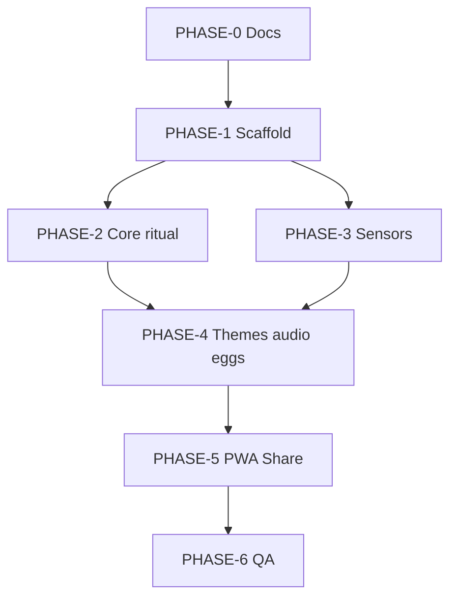

# AI Workflow — Context Limits & Multi-Agent Orchestration

This project is built entirely by AI agents. Design docs to minimize token load and enable **parallel phases in separate chats**.

## Context budget rules

1. **Never paste full chat history** into a new agent — use `HANDOFF.md` + phase prompt from `docs/prompts/`.
2. **Cap reads at 3 domain files** per session (see [README.md](./README.md) doc map).
3. **Do not duplicate data** — answer strings live only in [ANSWERS.md](./ANSWERS.md); requirements only in [PRD.md](./PRD.md).
4. **Prefer grep/code over doc re-read** once `src/` exists.
5. **Output handoff block** at end of every phase (template below).

## Agent roles

| Role | Responsibility | Writes to |
|------|----------------|-----------|
| **Coordinator** | Phase order, merge conflicts, updates `HANDOFF.md`, unblocks | `HANDOFF.md` only |
| **Implementer** | Code for one phase | `src/`, tests |
| **Reviewer** | Read-only diff review vs PRD acceptance | comments → Coordinator |
| **Copy** (optional) | Theme answer edits | `ANSWERS.md` → sync `src/data/` |

**Coordinator is the human's main chat OR a dedicated "orchestrator" chat** that does not implement large features.

## Phase graph



**Parallelizable after PHASE-1:**

- **PHASE-2** (UI/state/answers) and **PHASE-3** (shake hook) in **two separate chats**, merge via Coordinator.
- Do not run two agents editing the same files simultaneously.

## When to start a new chat

| Signal | Action |
|--------|--------|
| Phase complete per `HANDOFF.md` | New chat with next `docs/prompts/PHASE-*.md` |
| Context feels "muddy" (>15 files touched) | New chat + handoff |
| iOS device QA | Dedicated **PHASE-3** or **PHASE-6** chat with `SENSORS.md` only |
| User changed copy/themes | **Copy agent** → `ANSWERS.md` only, then small sync chat |

## Parallel execution pattern (recommended)

1. **Chat A (Coordinator):** User approves phase → update `HANDOFF.md` → paste prompt to Chat B/C.
2. **Chat B (PHASE-2):** Implementer loads `DESIGN` + `ARCHITECTURE` + builds ritual UI.
3. **Chat C (PHASE-3):** Implementer loads `SENSORS` + implements `useShake` + permission UI.
4. **Chat A:** Merge branches, run `npm test`, update `HANDOFF.md`, queue PHASE-4.

Use Cursor **Task** subagents for exploration only; implementation phases use **fresh chats** with prompt files for reproducibility.

## Handoff block template (required at phase end)

```markdown
## Handoff — PHASE-N
**Status:** complete | blocked
**Agent:** AGENT-###
**Changed:** [file list]
**Verified:** [commands run, e.g. npm test]
**Acceptance:** [REQ-IDs satisfied]
**Next:** PHASE-(N+1) — [one-line objective]
**Blockers:** none | [description]
**Notes for next agent:** [≤5 bullets]
```

Coordinator copies this into `HANDOFF.md` § Latest + checklist.

## Git / branch strategy (suggested)

- `main` — deployable
- `phase/N-short-name` — one branch per phase; PR merge by Coordinator
- Avoid long-lived feature branches across phases

## Implementation order inside a phase

1. Read HANDOFF + phase prompt only.
2. List REQ-IDs you will satisfy.
3. Implement smallest vertical slice.
4. Run tests listed in PRD for those REQs.
5. Emit handoff block; do not start next phase in same chat unless user asks.

## Prompt files

Copy-paste starters: [docs/prompts/](./prompts/)

## Coordinator checklist (each session start)

- [ ] Read `HANDOFF.md` — confirm `current_phase`
- [ ] Confirm no other agent owns same files (see § Active locks in HANDOFF)
- [ ] Pick doc map row from README for this phase
- [ ] On complete: update phase checkbox + Latest handoff

## Production deploy (overseer only — not an agent phase)

| Step | Who | When |
|------|-----|------|
| `npm run build && npm test` | Implementer / Coordinator | Each phase |
| QA matrix + Lighthouse | PHASE-6 implementer | Before deploy |
| Push `main` to GitHub | Overseer | After PHASE-6 |
| Connect Vercel (or CF Pages) to repo | Overseer | After PHASE-6 |
| Record prod URL in HANDOFF `deploy_url` | Overseer → Coordinator | Last |

Agents may add `vercel.json` (or equivalent) as **static config** only. Missing CLI auth is **not** a handoff blocker.
